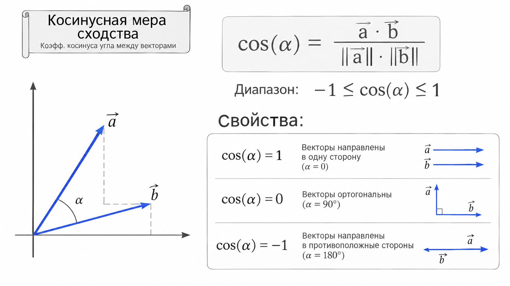
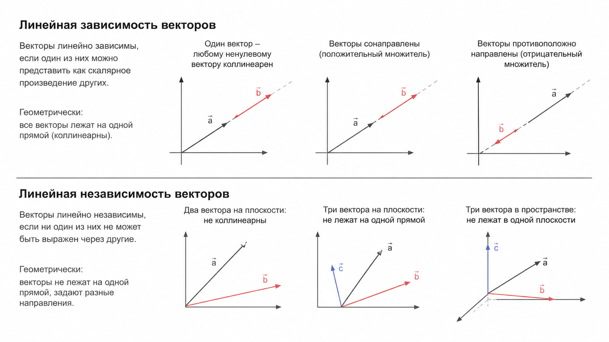
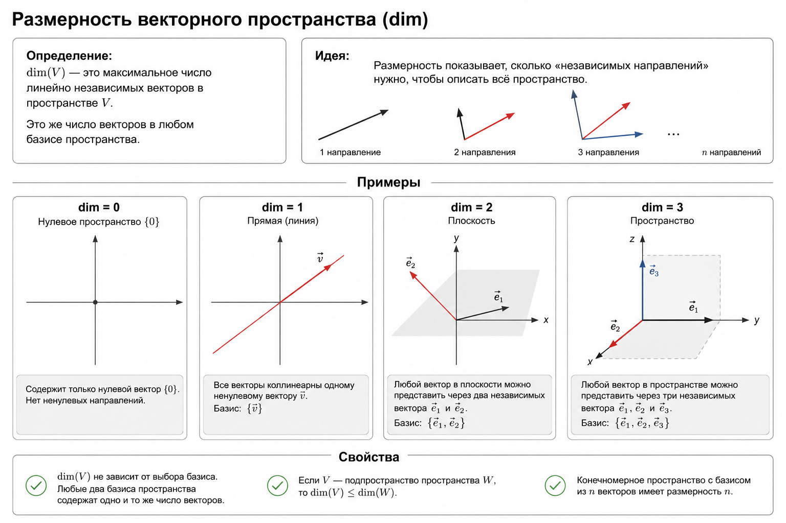

# Тема: Линейная алгебра

**Источники:**

- [Линейная алгебра для нейросетей: векторы на практике | Хабр](https://habr.com/ru/articles/1001896/)
- [Линейная алгебра. Векторы | Яндекс Образование](https://education.yandex.ru/handbook/math/article/vektori)
- [Линейная зависимость векторов. Базис | ВятГУ](https://e.vyatsu.ru/pluginfile.php/462376/mod_resource/content/2/5.%20%D0%91%D0%B0%D0%B7%D0%B8%D1%81%20%D0%B2%20%D0%92%D0%9F%20%D0%9B%D0%B5%D0%BA%D1%86%D0%B8%D1%8F%205.pdf)

## Зачем это нужно

Линейная алгебра упрощает представление и конструирование нейронных сетей, а также ускоряет вычисления благодаря параллельной обработке данных.

В программировании и компьютерной графике векторы используются для представления данных в виде упорядоченного списка чисел для последующих вычислений над ними.

## Теория

Вектор — это математический объект, характеризующийся величиной и направлением и представленный в виде последовательности значений. Например:

$$a (2, 3, 4, 0, 8, ..., 7)$$

Математически компоненты вектора представляют из себя координаты в n-мерной системе. 
Например: в двумерном пространстве вектор v имеет координаты 2 по оси x и 5 по оси y:
$$v=(2,5)$$

Если речь идет о данных, то каждая координата в отдельной записи описывает некую характеристику/особенность (feature). То есть вектор становится уже объектом, пребывающем в пространстве признаков.

Скаляр — это величина, не имеющая направления и описывающаяся одним числом.

### Операции с векторами

- **Умножение на скаляр**: это умножение каждой компоненты вектора на заданное число. На практике оно сжимает или растягивает конкретный вектор, а так же может изменить его направление на противоположное в зависимости от знака. 
Подобное умножение не меняет угол изначального вектора.

- **Сложение векторов**: операция покомпонентного сложения, результатом которой будет новый вектор. Геометрически, он будет указывать на точку, на которую укажет один из слагаемых векторов, если переместить его начало в конец другого.

- **Стандартное скалярное произведение**: операция, которая отображает пару векторов в скаляр. На практике оно показывает взаимную направленность векторов.
Скалярное произведение играет ключевую роль в машинном обучении, особенно в методах нахождения ближайших соседей и методах классификации, таких как метод опорных векторов (SVM).

- **Норма**: числовая характеристика вектора, которая обобщает понятие модуля. Простейший случай — Евклидова норма, характеризующая длину вектора, то есть расстояние от начала координат до заданной точки.

- **Косинусная мера**: нормированное скалярное произведение, которое показывает, насколько близки направления двух векторов независимо от их длин.
Косинусная мера очень часто применяется в NLP-моделях для оценки близости слов.

  - $\cos \theta=1$, если векторы направлены в одну сторону;
  - $\cos \theta=0$, если векторы ортогональны (перпендикулярны);
  - $\cos \theta=-1$, если векторы направлены в противоположные стороны.
  
- **Векторное произведение векторов**: операция, дающая в результате новый вектор, который перпендикулярен исходным, а его длина равна площади построенного на них параллелограмма.

### Линейная зависимость

**Линейной комбинацией** векторов $a_1, a_2, ... , a_m$ называется вектор вида $$r_1a_1 + r_2a_2 +...+ r_ma_m,$$
где все $r_i$ называются коэффициентами при векторах $a_i$.

Другими словами, **линейная комбинация** системы векторов – это любой
вектор, построенный из данных с помощью операций сложения и умножения
на число.

Линейная комбинация называется **нулевой (тривиальной)**, если все коэффициенты,
указанные в ее записи, равны нулю. Если есть хотя бы один ненулевой
коэффициент, то линейная комбинация называется **ненулевой (нетривиальной)**.

Два и более вектора называются **линейно зависимыми**, если среди
них найдется вектор, равный линейной комбинации остальных векторов. То
есть, система векторов линейно зависима, если один из них можно получить
из остальных с помощью операции сложения и умножения на число.

Система векторов будет линейно **независимой**
тогда и только тогда, когда равенство их линейной комбинации нулевому
вектору выполняется только при нулевых коэффициентах.

С точки зрения анализа данных, проверить линейную зависимость признаков в датасете — значит понять, нет ли там избыточной информации (коллинеарности).

### Базис

Под **базисом** системы векторов понимают такую ее линейно независимую подсистему, через которую линейно выражается вся эта система.
Это означает, что любой вектор $v ∈ V$ можно представить в виде линейной комбинации базисных векторов:
$$v=λ_1v_1+λ_2v_2+...+λ_nv_n,$$
где $λ_i ∈ R$ — координаты вектора $v$ в выбранном базисе.

Свойства базиса:

- Всякое векторное пространство V обладает базисом;
- Любой вектор в V единственным образом представляется через базис;
- Любые два базиса V содержат одно и то же число векторов.

Выбор базиса очень важен при работе с данными — например, методы снижения размерности (PCA и другие) фактически ищут «хороший» базис, в котором данные выглядят проще 
(часто это значит, что большинство координат становятся близкими к нулю).

### Размерность

**Размерность** векторного пространства V — это число векторов в базисе этого пространства. Обозначается как 
dim(V). Размерность показывает минимальное число векторов, достаточное для порождения пространства. Говоря по-простому, 
dim(V) — это величина, показывающая, насколько векторное пространство большое, она характеризует «количество степеней свободы» в пространстве.

В контексте анализа данных размерность отражает, сколько координат нужно, чтобы описать объекты. 
А если признак вносит мало информации, иногда его можно исключить или заменить, уменьшая размерность и сохраняя достаточную полноту описания.

## Связанная практика

- [0.1-practice-habr-KuzMax13.ipynb](0.1-practice-habr-KuzMax13.ipynb) — практика и домашнее задание из статьи с Хабра
- [0.1-practice-yandex.ipynb](0.1-practice-yandex.ipynb) — практика и задания из статьи Яндекс Образования
- [0.0-math-problem-set.ipynb (Часть 1)](../0.0-math-problem-set.ipynb) - задачник по Этапу 0