# Тема: Матрицы

- [Матрицы | Яндекс Образование](https://education.yandex.ru/handbook/math/article/matritsi)
- [Определитель | Яндекс Образование](https://education.yandex.ru/handbook/math/article/opredelitel)
- [Спектральные методы и матричные разложения | Яндекс Образование](https://education.yandex.ru/handbook/math/article/spektralnie-metodi-i-matrichnie-razlozheniia)
- [Что такое матрицы: разбираемся и решаем системы линейных уравнений | SkillFactory](https://blog.skillfactory.ru/chto-takoe-matritsy-razbiraemsya-i-reshaem-sistemy-lineinyh-uravnenii/)
- [NumPy: матрицы и операции над ними | МФТИ и Яндекс](https://github.com/maxis42/Machine-Learning-and-Data-Analysis-Coursera-Yandex-MIPT/blob/master/1%20Mathematics%20and%20Python/Lectures%20notebooks/10%20numpy%20arrays%20and%20operations%20with%20them/matrix_operations-.ipynb)
- [Собственные значения (числа) и собственные векторы | Матпрофи](https://mathprofi.ru/sobstvennye_znachenija_i_sobstvennye_vektory.html)

## Зачем это нужно

В работе с данными строки матрицы часто соответствуют объектам, а столбцы — признакам. В машинном обучении операции с матрицами лежат в основе линейных моделей, нейронных сетей и преобразований признаков.

## Теория

**Матрицей** размера **m×n** называется прямоугольная таблица из элементов, у которой **m** строк и **n** столбцов. Элементы матрицы обозначаются одной и той же буквой с двумя индексами, первый из которых — номер строки, а второй — номер столбца.

Примеры интерпретации матриц:

- **Табличные данные.** B машинном обучении, когда у нас есть m объектов и n признаков, мы храним данные как матрицу (m×n).
- **Изображения.** Каждый пиксель черно-белого изображения представляет собой число, которое отражает степень насыщенности цвета. Тогда изображение можно представить в виде сетки из пикселей — матрицы чисел.

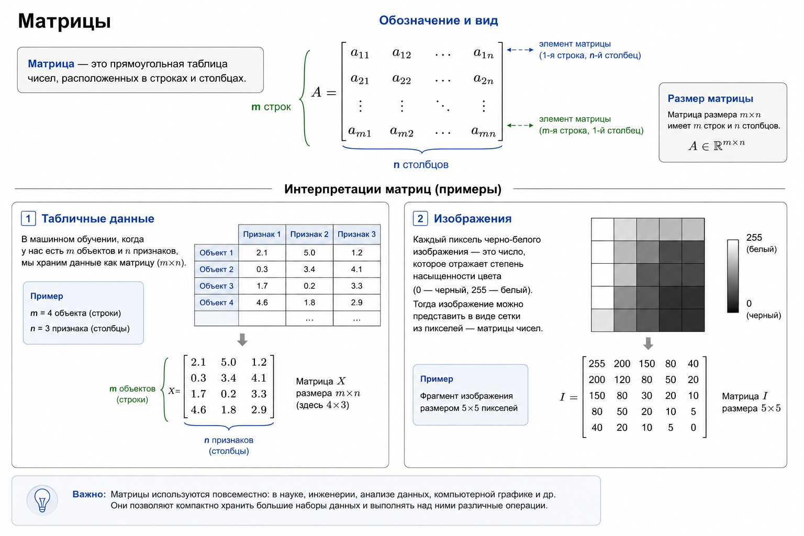

### Типы матриц

1. **Прямоугольная матрица.** Матрица, у которой число строк не равно числу столбцов (m≠n).
2. **Квадратная матрица.** Матрица, у которой число строк равно числу столбцов (m=n).
3. **Диагональная матрица.** Квадратная матрица, у которой все элементы вне главной диагонали равны нулю. **Главной диагональю** называют мысленную линию, которую можно провести через элементы $a_ij$, где $i = j$.
4. **Верхнетреугольная матрица.** Квадратная матрица, у которой все элементы ниже главной диагонали равны нулю, то есть $a_ij = 0$ при $i > j$. А если все элементы выше главной диагонали равны нулю ($i < j$), то такая матрица называется **нижнетреугольной**.
5. **Единичная матрица.** Диагональная матрица, у которой все элементы главной диагонали равны 1. Часто обозначается как E или I.
6. **Разрежённая матрица.** Матрица, в которой большая часть элементов равна нулю.

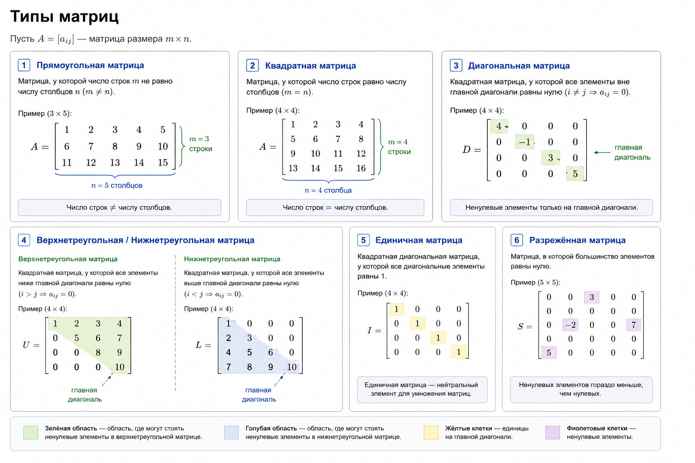

### Тензор

**Тензор** — это математический объект, который обобщает понятия скаляров, векторов и матриц. Можно представить его как многомерный массив чисел, где:

- тензор нулевого порядка — это скаляр (одно число);
- тензор первого порядка — это вектор (одномерный массив);
- тензор второго порядка — это матрица (двумерный массив);
- тензоры более высокого порядка — это массивы с тремя и более индексами.

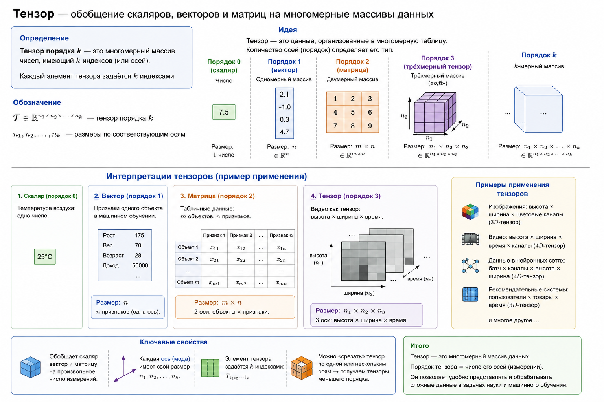

### Операции над матрицами

- **Транспонирование матриц.** Чтобы транспонировать матрицу, нужно ее строки записать в виде столбцов.

    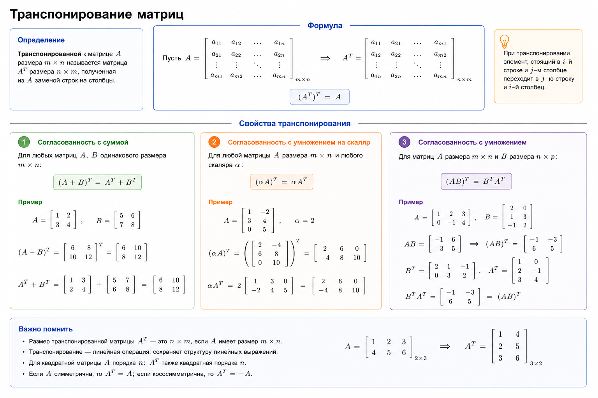

- **Сумма и разность матриц.** Для того чтобы сложить матрицы, нужно сложить их соответствующие элементы. Чтобы найти разность матриц, надо найти разность их соответствующих элементов. 

    *Важно:* складывать можно только матрицы одинакового размера. При этом на практике можно выполнять арифметические операции над объектами уже разного размера, автоматически «расширяя» меньший объект так, чтобы его размеры стали совместимы с размерами большего объекта.

    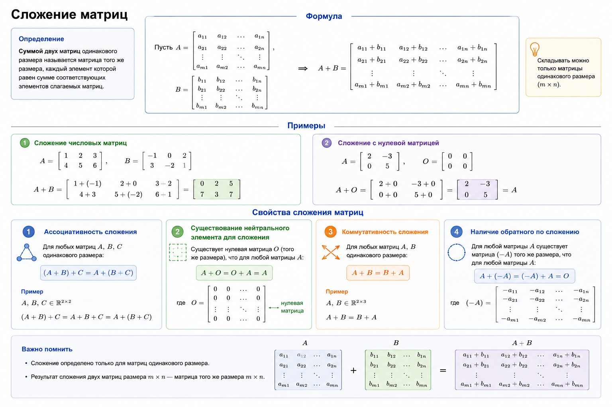

- **Умножение на скаляр.** Чтобы умножить матрицу на число, нужно каждый элемент матрицы умножить на это число.

    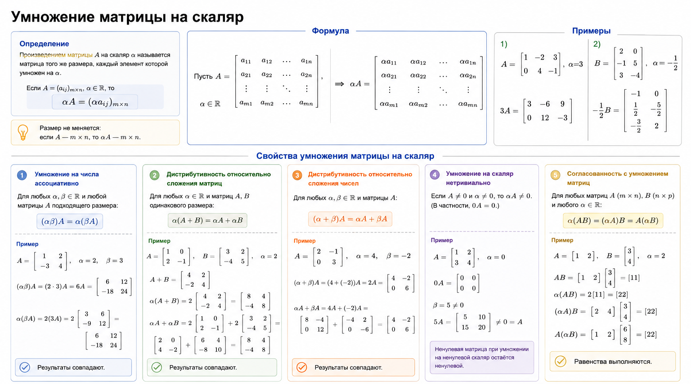

- **Умножение матриц.** Чтобы получить произведение этих матриц, нужно каждый элемент верхней строки первой матрицы умножить на соответствующий элемент второй матрицы и получившиеся произведения сложить. Таким образом получаем первый элемент произведения. Также поступаем с нижней строкой первой матрицы и в результате получаем второй элемент произведения. По сути, при умножении матриц применяется принцип «строка на столбец».

    *Важно:* произведение двух матриц определено только тогда, когда их размеры согласованы, а именно когда число столбцов первой матрицы равно числу строк второй.

    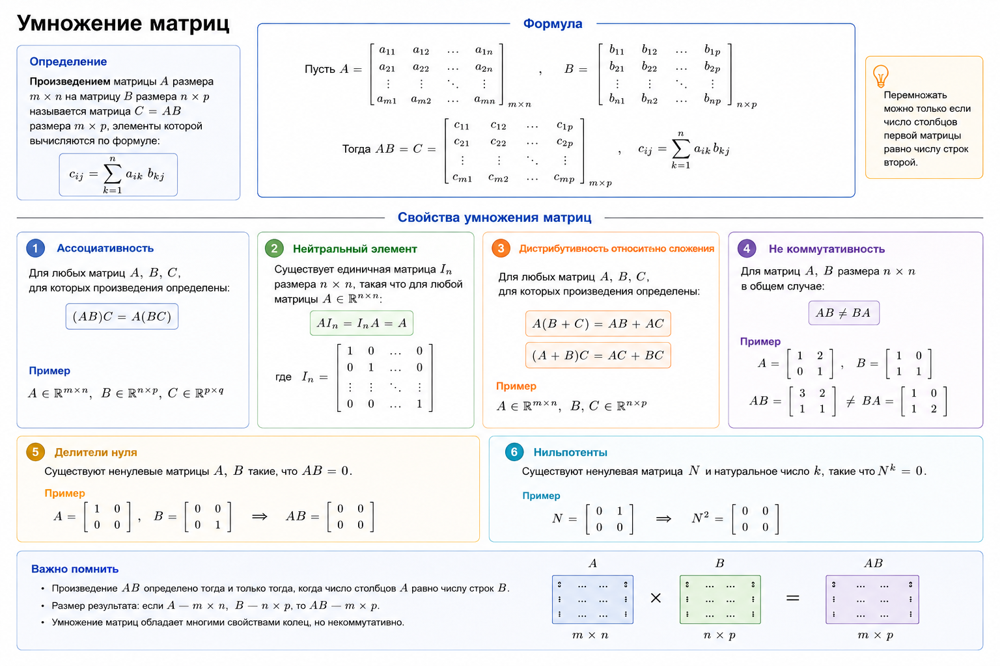

В нейронных сетях, особенно в полносвязных (fully-connected), каждый слой можно рассматривать как матричное преобразование.

Например, если на вход слоя приходит вектор $h^{l-1}$ размерности n, он умножается на матрицу весов $W^l ∈R^{m×n}$и складывается со смещением (bias) $b^{(l)} ∈ R^m$, в результате чего получается новый вектор $h^{(l)}$ размерности m.

$$h^{(l)} = W^{(l)}h^{(l-1)}+b^{(l)}$$

Таким образом, в нейронных сетях матричные операции играют ключевую роль при обработке данных, где веса и смещения (bias) обновляются в процессе обучения, что позволяет сети обучаться на данных.

### След матрицы

**След** — это сумма диагональных элементов матрицы.

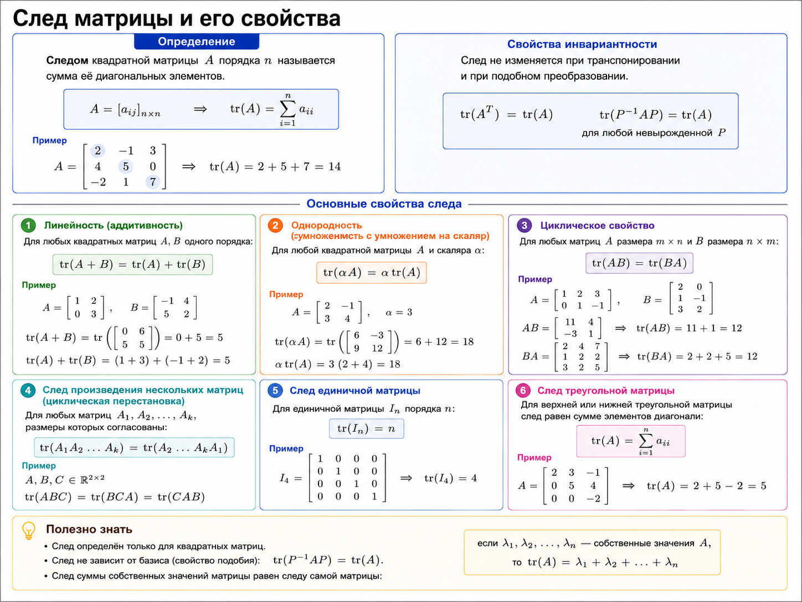

### Определитель матрицы

В линейной алгебре у матриц есть куда более глубокий смысл — с их помощью можно задавать **линейные отображения**. Линейное отображение оказывает на геометрические объекты или пространство в целом эффект, называемый **линейной деформацией**.

Применяя линейное преобразование ко всем векторам пространства, мы не просто изменяем отдельные точки, а получаем новое представление о том, как преобразуется всё пространство: его форма, ориентация и масштаб. Это позволяет нам перейти от локального понимания действия матрицы к глобальному — увидеть, как матрица изменяет само полотно пространства.

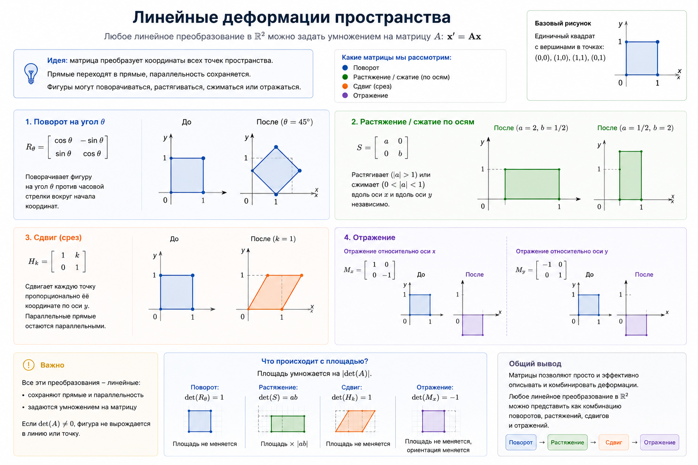

**Определитель** можно представить как числовой «коэффициент масштабирования», который показывает, во сколько раз линейное преобразование изменяет объём (или площадь) пространства, а также указывает на сохранение или изменение его ориентации.

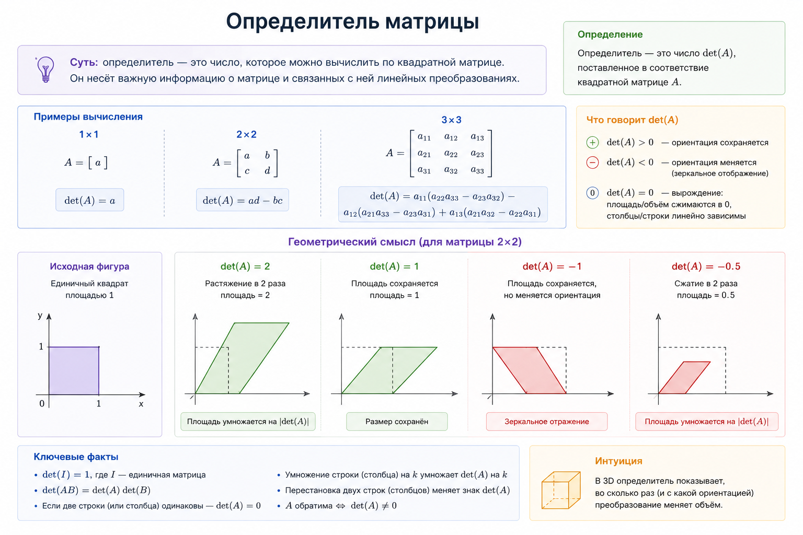

В действительности мы можем считать определитель как ориентированную площадь (учитывая знак, который показывает, сохраняется или меняется ориентация) параллелограмма, натянутого на векторы, которые уложены как векторы-столбцы в матрицу A, задающую деформацию:
$$A = (A_1 | ... | A_n) ∈ M_n(R),  A_i ∈ R^n$$
Если мы подействуем матрицей A на наши базисные векторы, то полученные образы этих векторов и будут в точности столбцы матрицы A.

Таким образом, определитель — это n-мерный ориентированный объём, натянутый на векторы матрицы, задающей линейное отображение (деформацию пространства).

### Обратимые матрицы

Для матрицы $B ∈ M_n(R)$ матрица $B^{-1}$ называется **обратной**, если выполняется равенство $BB^{-1} = B^{-1}B = E$, а сама матрица B в таком случае называется **обратимой**.

Для произвольной матрицы $B ∈ M_n(R)$ не гарантировано существование обратной матрицы, но если матрица B обратима, то существует матрица $B^{-1}$, удовлетворяющая $BB^{-1} = B^{-1}B = E$, и эта матрица $B^{-1}$ единственна.

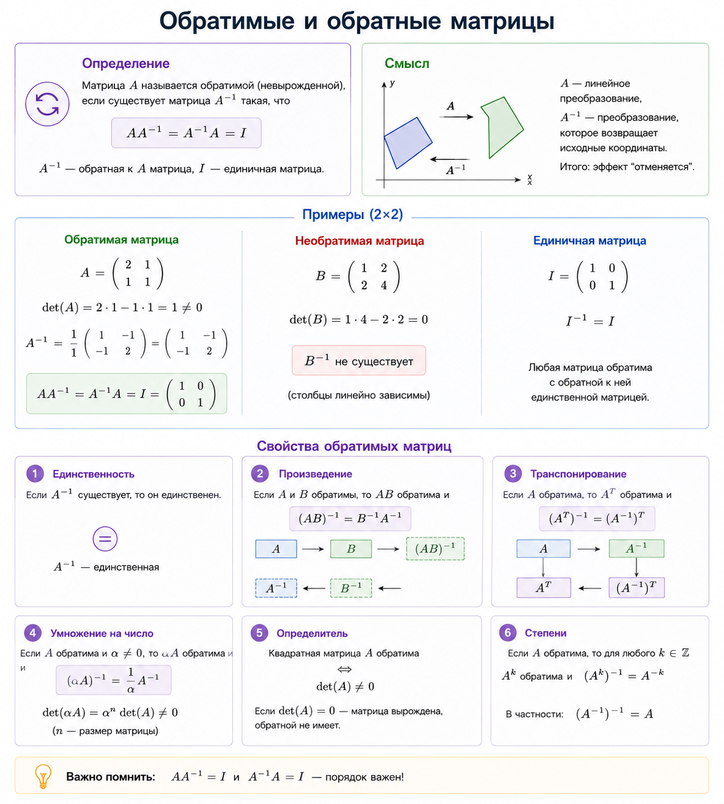

### Невырожденные матрицы

**Невырожденная матрица** — это квадратная матрица, определитель которой отличен от нуля. В противном случае матрица называется вырожденной.

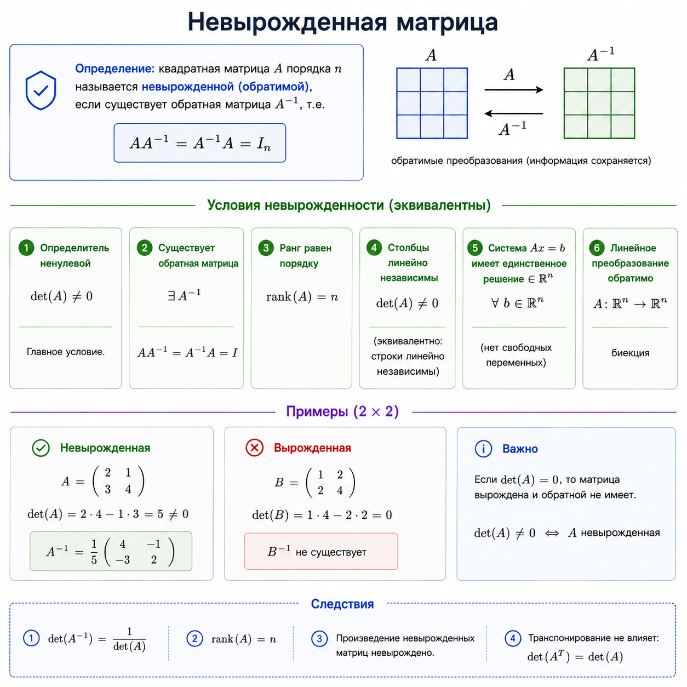

### Ортогональные матрицы

**Ортогональная матрица** — это квадратная матрица, столбцы (или строки) которой образуют ортонормированный базис.

То есть это матрица, у которой:

- Каждый столбец имеет единичную длину (норму).
- Любые два различных столбца ортогональны друг другу.

Пример: $$Q = \begin{pmatrix} 0 & 1 \\ -1 & 0 \end{pmatrix}$$

### Собственные значения и векторы

Ненулевой вектор v, который при умножении на некоторую квадратную матрицу A превращается в самого же себя с числовым коэффициентом λ, называется **собственным вектором** матрицы A. Число λ называют **собственным значением** или **собственным числом** данной матрицы.
$$A⋅v = λ⋅v, v \neq 0$$

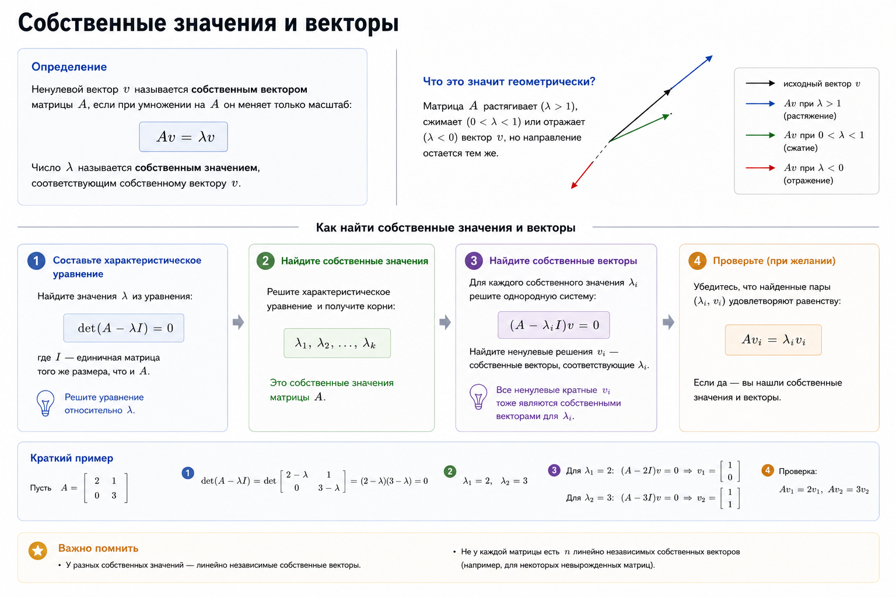

Собственный вектор — это такой вектор, который сохраняет своё направление при действии матрицы, а собственное значение показывает, во сколько раз он при этом растягивается или сжимается.

Геометрически собственные векторы — это направления, в которых действие матрицы проявляется как масштабирование.

И это масштабирование определяется как раз собственным значением.

На рисунке ниже показано поведение собственных векторов при изменении пространства матрицей в сравнении с поведением векторов изначального ортонормированного базиса. Собственные векторы сохраняют направление (масштабируются), остальные — поворачиваются и искажаются.

### Диагонализация

**Диагональный вид** матрицы - это такой вид, при котором на диагонали окажутся собственные значения, которые масштабируют каждый соответствующий собственный вектор. Это представление называется **диагонализацией** матрицы.

Диагонализацией называется процесс нахождения соответствующей диагональной матрицы для диагонализируемой матрицы или линейного отображения:
$$A = PDP^{-1}$$
Где P — матрица, в которой столбцы — собственные векторы матрицы A; D — диагональная матрица собственных значений.

Квадратная матрица, которую нельзя диагонализировать, называется дефектной.

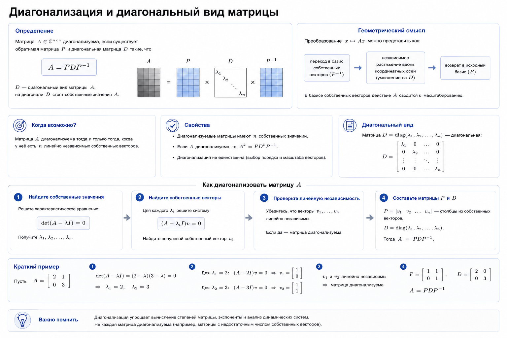

Однако не всякая матрица допускает диагонализацию (даже над C). Чтобы матрица была диагонализуема, необходимо, чтобы у неё нашёлся полный базис из линейно независимых собственных векторов. В противном случае построить разложение вида 
$A = PDP^{-1}$  невозможно.

Но есть важный и очень приятный класс матриц — это симметричные матрицы.

**Симметричная матрица** — это квадратная матрица, которая остается неизменной после транспонирования:
$$A = A^T$$

Если матрица $A ∈ R^{n × n}$ симметрична и допускает полный набор линейно независимых собственных векторов, то её всегда можно диагонализовать.

### Спектральный радиус

**Спектральный радиус** матрицы A — это максимальное по модулю собственное значение этой матрицы:
$$ρ(A) = \max_i |λ_i|$$

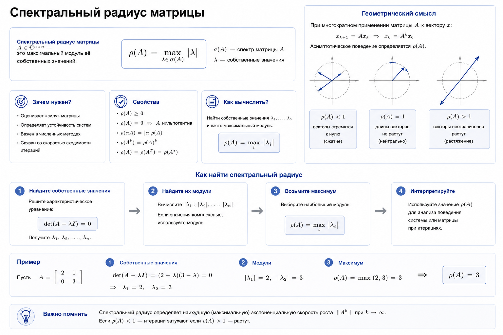

Спектральный радиус показывает, насколько сильно матрица может растянуть вектор, не меняя его направления. То есть максимальный коэффициент растяжения вдоль собственного направления вектора.

В машинном обучении спектральный радиус особенно важен для анализа двух ключевых процессов:

- **Анализ сходимости градиентного спуска.** В задачах оптимизации квадратичных функций (или локально квадратичных приближений) спектральный радиус матрицы Гессиана H ограничивает максимально допустимый шаг градиентного спуска для сходимости.
    
    То есть спектральный радиус Гессиана функции потерь H влияет на скорость сходимости и выбор шага обучения η:
    $$η < \frac{2}{ρ(H)}$$

- **Анализ стабильности рекуррентных нейронных сетей (RNN).** Чтобы избежать взрыва или затухания градиентов при обучении, нужно, чтобы спектральный радиус у скрытого состояния (hidden state) W был равен или был меньше единицы:
$$ρ(W) ≤ 1$$

### Ранг матрицы

**Рангом матрицы** называется максимальное число линейно независимых строк (столбцов) этой матрицы.

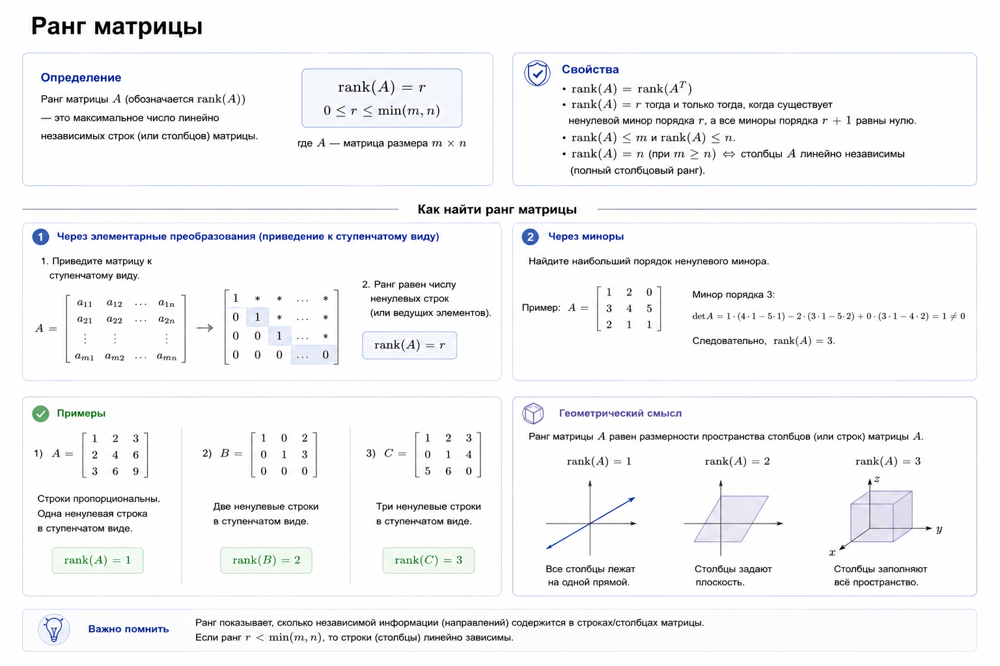

### Разложения матриц

**Разложение**, или **факторизация**, — это разделение исходной матрицы на произведение нескольких более простых матриц.

- **QR-разложение** — один из ключевых инструментов линейной алгебры, который находит применение в решении линейных систем, задачах метода наименьших квадратов, вычислениях собственных значений и т. д. Его численная стабильность и эффективность делают его ценным методом в широком спектре приложений.

    Формально QR-разложение представляет собой матричную факторизацию, при которой матрица A раскладывается на произведение ортогональной матрицы Q и верхнетреугольной матрицы R: A=QR.

    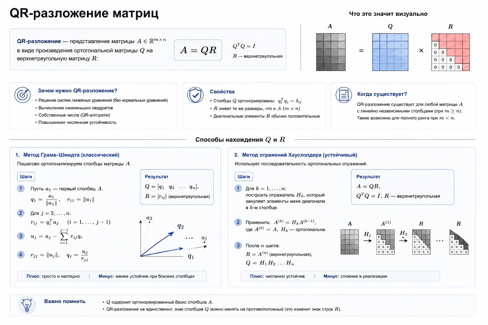

    QR-разложение — это геометрический способ упростить вычисления и повысить численную устойчивость в задачах машинного обучения.

- **Полное сингулярное разложение** (Singular Value Decomposition, SVD) представляет любую матрицу \(A \in \mathbb{R}^{m\times n}\) в виде произведения трех специальных матриц:
    $$A = U \Sigma V^T$$
    где

    - $U \in \mathbb{R}^{m\times m}$ — ортогональная матрица левых сингулярных векторов;
    - $\Sigma \in \mathbb{R}^{m\times n}$ — диагональная матрица сингулярных значений;
    - $V \in \mathbb{R}^{n\times n}$ — ортогональная матрица правых сингулярных векторов.  

    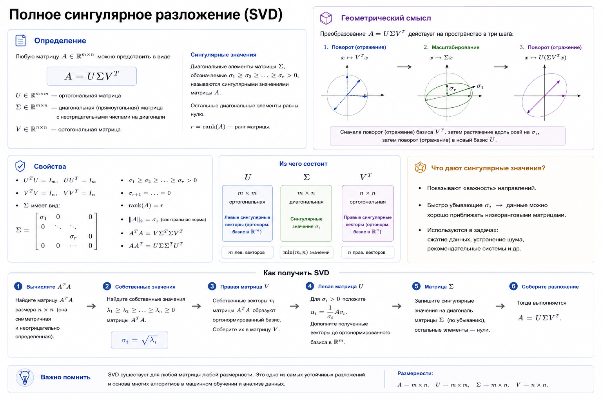

    Особенность SVD заключается в том, что такое разложение существует **для любой матрицы**, независимо от ее размера, ранга или симметричности. Матрицы $U$ и $V$ являются ортогональными, а матрица $\Sigma$ содержит на диагонали неотрицательные сингулярные значения, расположенные по убыванию.

    Сингулярные значения связаны с собственными значениями матрицы $A^TA$:
    $$\sigma_i=\sqrt{\lambda_i(A^TA)}$$

    С геометрической точки зрения SVD показывает, каким образом матрица преобразует пространство. Любое линейное преобразование можно представить как последовательность трех простых действий.

    Сначала пространство поворачивается (или отражается) с помощью матрицы $V^T$. Затем выполняется независимое растяжение или сжатие вдоль взаимно перпендикулярных направлений, задаваемое диагональной матрицей $\Sigma$. После этого выполняется еще один поворот (или отражение), определяемый матрицей $U$. Благодаря этому становится понятно, какие направления пространство растягиваются сильнее, а какие практически исчезают.

    Главная идея применения SVD заключается в выделении наиболее значимой информации из данных. Если некоторые сингулярные значения малы, их можно отбросить, практически не изменяя основную структуру матрицы. Это позволяет заменить исходную матрицу более простой, сохранив большую часть содержащейся в ней информации.

    По этой причине SVD широко используется при сжатии изображений, уменьшении размерности данных, фильтрации шума, рекомендательных системах и анализе больших массивов данных. Во всех этих задачах разложение помогает отделить важную информацию от менее значимой.

- **Разложение Холецкого** представляет симметричную положительно определенную матрицу в виде произведения нижнетреугольной матрицы на ее транспонированную. Такой вид разложения значительно упрощает многие вычисления по сравнению с общим LU-разложением.

    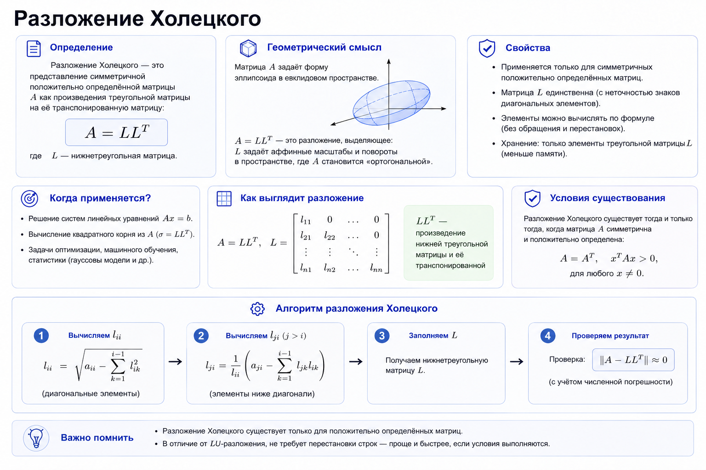

    Однако разложение Холецкого существует не для всех матриц. Оно применяется только тогда, когда матрица является симметричной и положительно определенной. При выполнении этих условий разложение существует и является единственным (если диагональные элементы матрицы $L$ считаются положительными).
    $$A = LL^T,$$
    где

    - L — нижнетреугольная матрица;
    - диагональные элементы L положительны.

    Условия существования:
    $$A=A^T,$$
    $$x^TAx>0,\qquad \forall x\neq0$$

    Разложение Холецкого можно рассматривать как способ описать сложное линейное преобразование через одно более простое преобразование и его транспонированную копию.

    Если матрица задает преобразование пространства, то матрица \(L\) выполняет последовательное изменение координат, масштабируя и комбинируя оси. Последующее умножение на \(L^T\) завершает преобразование таким образом, что сохраняется симметрия исходной матрицы. Благодаря этому разложение особенно хорошо подходит для работы с квадратичными формами и матрицами, описывающими расстояния, энергии или ковариации.

    Основная идея применения разложения Холецкого состоит в том, чтобы заменить сложные вычисления с полной матрицей более быстрыми вычислениями с треугольной матрицей. После разложения многие задачи сводятся к последовательному решению двух систем линейных уравнений, что требует значительно меньше вычислений.

    Поэтому разложение Холецкого активно используется при решении систем линейных уравнений, в численной оптимизации, статистике, обработке ковариационных матриц, машинном обучении и вычислениях с гауссовскими распределениями. Во всех этих случаях оно позволяет существенно ускорить вычисления при сохранении высокой численной устойчивости.

### Матрицы в NumPy

- **Индексирование** матриц:

    

- **Броадкастинг**:

    Обычно для выполнения арифметических операций с матрицами они должны быть одинакового размера. Однако в NumPy можно оперировать матрицами различного размера за счёт механизма `broadcasting`. При этом действуют следующие правила:

    1. Если объекты имеют разное число измерений, к объекту с меньшим числом измерений добавляются измерения длины 1 слева.
    2. Для каждого соответствующего измерения длины должны совпадать или одна из них должна быть равна 1.

    

- **Поэлементное умножение** (*):

    Оператор * выполняет поэлементное умножение двух тензоров, которые должны иметь совместимые размеры (согласно правилам broadcasting). То есть если у вас есть два тензора одинакового размера (или они могут быть «расширены» до одного размера), то операция a * b перемножает соответствующие элементы: $$(a * b)_{ij} = a_{ij} ⋅ b_{ij}$$

- **Матричное умножение** (@ или `np.dot/np.matmul`):

    Оператор @ (введённый в Python 3.5) предназначен для матричного умножения согласно правилам линейной алгебры. При этом для двух векторов a и b операция a @ b вычисляет их скалярное произведение:
    $$a^t ⋅ b = \sum_{i=1}^n a_i b_i$$

    А для матриц A и B (при условии, что число столбцов A равно числу строк B) результатом будет матрица C, где:
    $$(AB)_{ij} = \sum_{t=1}^n A_{it} B_{tj}$$

    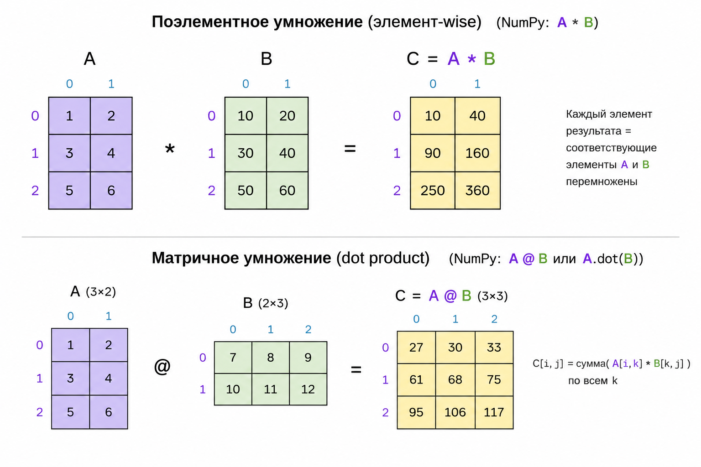

- **Определитель.** Функция `numpy.linalg.det()` оптимизирована за счёт использования библиотеки [LAPACK](https://github.com/Reference-LAPACK), что обеспечивает высокую скорость и низкий расход памяти при работе с матрицами, особенно если их размер невелик.

- **Обращение матриц.** В NumPy обратные матрицы вычисляются с помощью функции `numpy.linalg.inv(a)`, где a — исходная матрица.

- **Собственные числа и собственные вектора матрицы.** В NumPy собственные числа и собственные векторы матрицы вычисляются с помощью функции `numpy.linalg.eig(a)`, где `a` — исходная матрица. В качестве результата эта функция выдает одномерный массив `w` собственных чисел и двумерный массив `v`, в котором по столбцам записаны собственные вектора, так что вектор `v[:, i]` соотвествует собственному числу `w[i]`.

- **Ранг матрицы.** В NumPy ранг матрицы вычисляется с помощью функции `numpy.linalg.matrix_rank(M, tol=None)`, где `M` — матрица, `tol` — параметр, отвечающий за некоторую точность вычисления. В простом случае можно его не задавать, и функция сама определит подходящее значение этого параметра.

## Связанная практика

- [0.2-practice-mfti.ipynb](0.1-practice-mfti.ipynb) — практика с совместного курса МФТИ и Яндекса
- [0.2-practice-yandex.ipynb](0.2-practice-yandex.ipynb) — практика и задания из статьи Яндекс Образования
- [0.0-math-problem-set.ipynb (Часть 2)](../0.0-math-problem-set.ipynb) - задачник по Этапу 0
