# Тема: Основы математического анализа

**Источники:**

- [Производная для новичков: от основ к Python | Skillfactory](https://blog.skillfactory.ru/proizvodnaya-dlya-novichkov-ot-osnov-k-python/)
- [Пределы и непрерывность функций | Яндекс Образование](https://education.yandex.ru/handbook/math/article/predeli-i-neprerivnost-funktsii)
- [Дифференцирование функций одной переменной | Яндекс Образование](https://education.yandex.ru/handbook/math/article/differentsirovanie-funktsii-odnoi-peremennoi)
- [Частные производные и градиент | Яндекс Образование](https://education.yandex.ru/handbook/math/article/chastnie-proizvodnie-i-gradient)
- [Градиентные методы | Яндекс Образование](https://education.yandex.ru/handbook/math/article/gradientnie-metodi)
- [Матричное дифференцирование в машинном обучении: градиент, якобиан и линейная регрессия | Хабр](https://habr.com/ru/articles/1060392/)
- [Эти пугающие производные, градиенты, матрицы Якоби и Гессе | Хабр](https://habr.com/ru/companies/ruvds/articles/938950/)

## Зачем это нужно

Основы математического анализа — это фундамент для анализа данных, 
оптимизации и машинного обучения.
В анализе данных и машинном обучении многие алгоритмы работают итеративно, 
шаг за шагом приближаясь к оптимальному решению. Этот процесс невозможно 
представить без применения основ математического анализа, где понятие 
предела играет фундаментальную роль.

## Теория

### Функции

**Функция** — это правило, сопоставляющее каждому элементу области 
определения ровно одно значение из области значений.

Проще говоря, функция принимает на вход некоторое значение и выдаёт 
соответствующее ему выходное значение. В математике функцию обычно 
обозначают как $f(x)$, где $x$ — входная переменная, а $f(x)$ — 
соответствующее ей выходное значение.

Множество входных значений ещё называют **областью определения**, а 
множество выходных значений — **областью значений**.

### Предел последовательности и предел функции

**Предел последовательности** — это значение, к которому приближаются элементы 
последовательности по мере роста их номеров.

**Предел функции** описывает поведение её значений при приближении аргумента к 
определённой точке. Если значения функции становятся всё ближе к конкретному 
числу $L$ по мере приближения аргумента $x$ к $x_0$, говорят, что функция имеет 
предел $L$ в точке $x_0$.
​
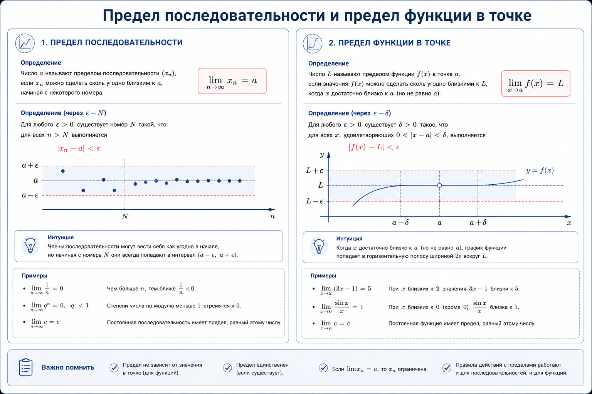

Когда функция приближается к точке с разных сторон, её поведение может быть 
различным. Для описания таких ситуаций существуют понятия **левостороннего** и 
**правостороннего** пределов:

- Левосторонний предел $lim_{x→x_0-0} f(x)$ — предел функции при $x$, 
стремящемся к $x_0$ слева ($x < x_0$).
- Правосторонний предел $lim_{x→x_0+0} f(x)$ — предел функции при $x$, 
стремящемся к $x_0$ слева ($x > x_0$).

Чтобы функция имела предел в точке $x_0$, левосторонний и правосторонний 
пределы в этой точке должны существовать и быть равны между собой. 
В противном случае говорят, что функция имеет **разрыв**.

### Непрерывность функций

**Непрерывность** обеспечивает стабильность и предсказуемость поведения моделей, 
позволяя понять, как малейшие изменения входных данных отражаются на 
результате.

Интуитивно функция называется непрерывной в точке, если небольшие изменения 
аргумента приводят к небольшим изменениям значения функции. Другими словами, 
функция ведёт себя предсказуемо, без резких скачков, в каждой точке своей 
области определения.

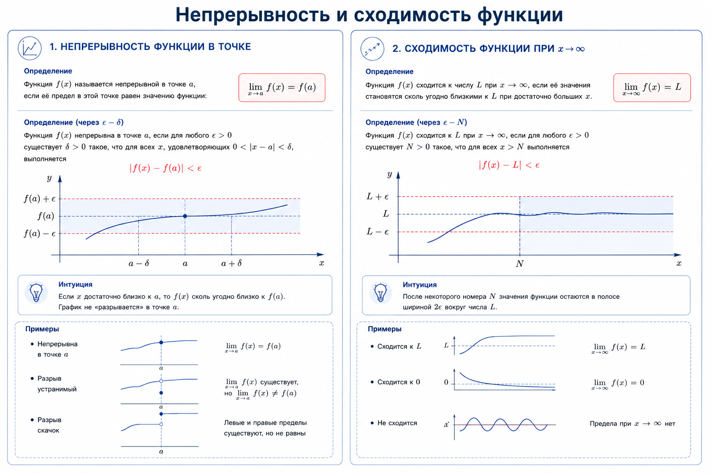

Более формально функция $f(x)$ называется непрерывной в точке $x_0$, 
если выполняются два условия:

1. Существует значение $f(x_0)$.
2. Существует предел $lim_{x→x_0} f(x)$, и он равен значению функции в этой точке:
$lim_{x→x_0} f(x) = f(x)$

Если хотя бы одно из этих условий нарушается, функция называется **разрывной** в точке $x_0$.

Когда мы говорим о непрерывных функциях, важно помнить, что непрерывность 
сама по себе не накладывает ограничений на скорость изменения функции. 
Функция может быть непрерывной, но при этом резко меняться, что может 
вызвать сложности в задачах оптимизации и анализа. Именно здесь на помощь 
приходит понятие **Липшицевой непрерывности**, которое вводит более строгий 
контроль за тем, насколько сильно значения функции могут изменяться в 
ответ на изменения входных данных.

**Липшицева непрерывность** — более строгая форма непрерывности, которая ограничивает скорость изменения функции. 
Это свойство важно для анализа сходимости и устойчивости алгоритмов.

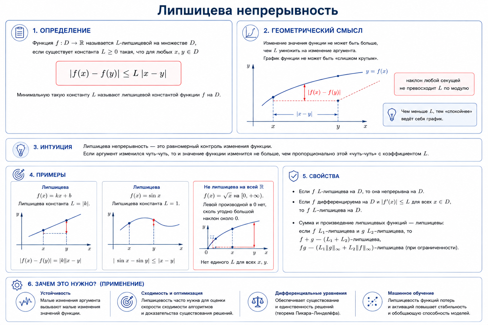

### Производная

**Производная** функции $f(x)$ в точке $x_0$ определяется как предел отношения 
приращения функции к приращению аргумента, если этот предел существует:
$$f'(x) = lim_{Δx→0}\frac{f(x_0+Δx)-f(x_0)}{Δx},$$
где

- $Δx$ - малое изменение (приращение) аргумента функции,
- $f(x_0+Δx)-f(x_0)$ - соответствующее изменение (приращение) значения функции.

Говоря простыми словами, **производная** — это скорость изменения функции.
В более общем смысле производная показывает, насколько сильно изменится 
значение функции при очень маленьком изменении ее аргумента. 
Это понятие позволяет нам анализировать поведение функций: находить их 
максимумы и минимумы, определять, где функция возрастает, а где убывает.

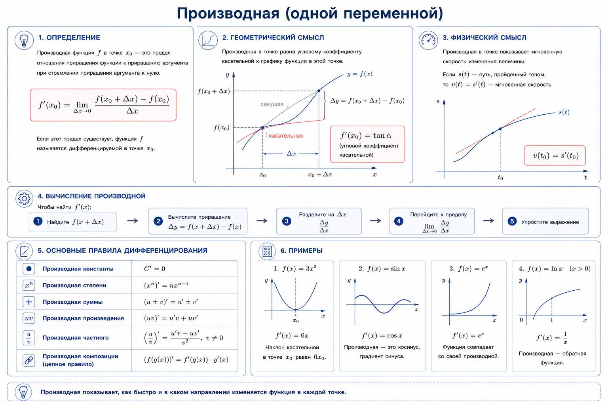

**Геометрический смысл производной.** Секущая линия — это прямая, которая пересекает график функции в двух точках. 
Если эти две точки всё ближе смещаются друг к другу, секущая линия начинает 
«приближаться» к **касательной** — прямой, которая касается графика функции 
только в одной точке и имеет с ним одинаковый наклон.
Геометрически производная в точке равна тангенсу угла наклона касательной к 
графику функции в этой точке.

Производная появляется, когда мы «приближаем» точку пересечения секущей с 
графиком к одной-единственной точке с координатами $(x_0, f(x_0))$, то есть 
берём предел при $Δx→0$. В этом случае секущая линия становится касательной, 
а её наклон — это уже точная скорость изменения функции в точке.

Если касательная направлена вверх, производная положительна, если вниз — 
отрицательна. Если касательная горизонтальна, производная равна нулю, что 
соответствует точке максимума или минимума функции.

У производных есть несколько важных свойств, которые упрощают их вычисление:

- Производная константы равна нулю: $(c)’ = 0$. Это логично, ведь константа не изменяется.
- Вынесение константы за знак производной: $(c * f(x))’ = c * f’(x)$.
- Производная суммы функций равна сумме производных: $(f(x) + g(x))’ = f’(x) + g’(x)$.
- Производная произведения функций: $(f(x) * g(x))’ = f’(x) * g(x) + f(x) * g’(x)$.
- Производная частного функций: $(f(x) / g(x))’ = (f’(x) * g(x) — f(x) * g’(x)) / g(x)^2$.

### Правило цепочки

Чтобы найти производную сложной функции, используется **цепное правило** 
(chain rule). Оно гласит, что производная сложной функции равна произведению 
производной внешней функции по ее аргументу на производную внутренней 
функции.

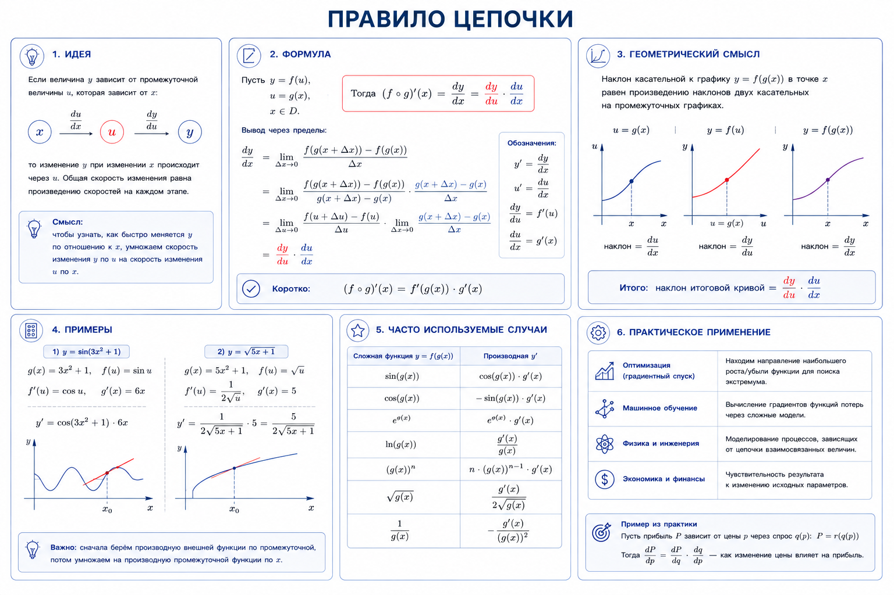

Если $h(x) = g(f(x))$, то $h'(x) = g'(f(x))⋅f'(x)$.

В нейронных сетях: изменение на выходе — это наклон последнего звена × как 
последнее зависит от предыдущего.

### Частная производная

**Частная производная** - это такой инструмент, который «замораживает» все 
переменные, кроме одной, и измеряет скорость изменения функции *только по 
выбранному направлению*.

Частная производная по $x$ функции $f(x,y)$ в точке $(x_0,y_0)$:
$$\frac{∂f}{∂x}(x_0,y_0) = lim_{h→0} \frac{f(x_0+h,y_0)-f(x_0,y_0)}{h}$$

Частная производная по y:
$$\frac{∂f}{∂y}(x_0,y_0) = lim_{k→0} \frac{f(x_0,y_0+k)-f(x_0,y_0)}{k}$$

Ключевая идея здесь в следующем: в числителе меняется только одна переменная 
($x$ или $y$), остальные заморожены на уровне $y_0$ или $x_0$. 
Это прямое обобщение обычной производной на многомерный случай.

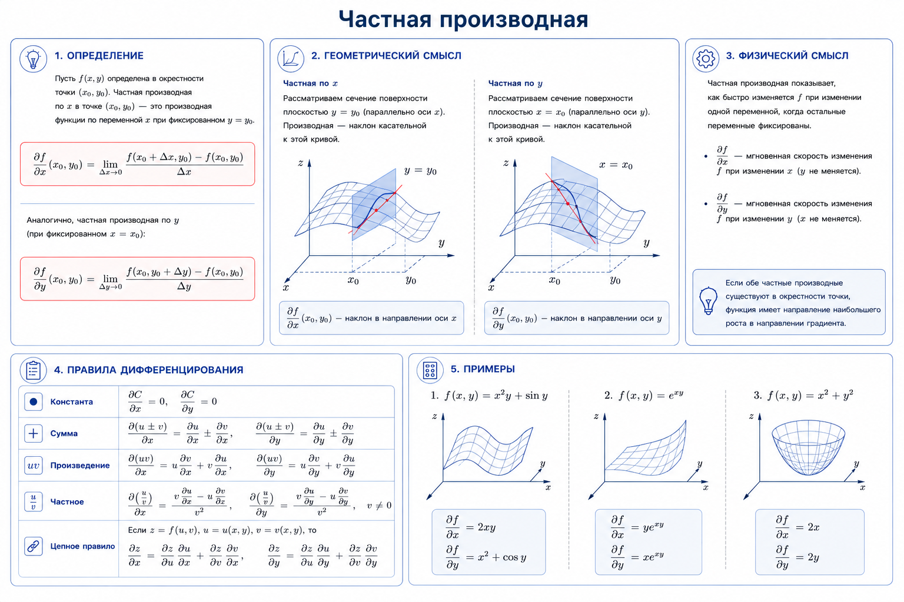

Когда мы замораживаем остальные переменные, то фактически фиксируем сечение 
многомерного пространства, а анализ частной производной превращается в 
изучение рельефа вдоль одной тропы — оси $X$ или $Y$.

Для вычисления частной производной по выбранной переменной дифференцируем 
функцию по этой переменной, рассматривая все остальные переменные как 
константы.

**Важно**: даже когда переменная объявлена константой для дифференцирования, 
она может участвовать в выражении. Цепное правило остаётся основным 
инструментом для работы со сложными функциями при вычислении частных 
производных.

### Градиент

**Градиент** функции $f:R^n→R$ в точке $x$ — это вектор
$$∇f(x)=(\frac{∂f}{∂x_1}(x),...,\frac{∂f}{∂x_n}(x)),$$
который собирает все частные производные в одну стрелку наклона поверхности.

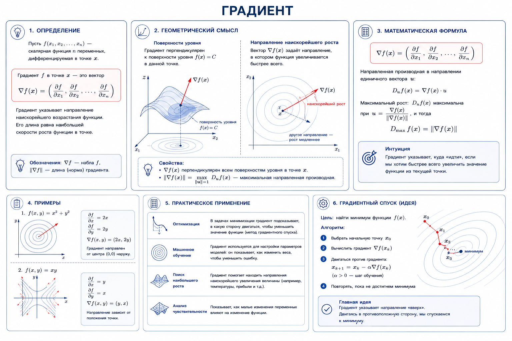

Градиент указывает направление наискорейшего роста, а его норма — величину 
максимальной направленной производной.

Взглянем на линии (или поверхности) уровня $f(x)=c$ (изолинии). Двигаясь 
по такому уровню, мы не меняем значение функции, значит, направленная 
производная вдоль касательной $v$ равна нулю: $D_vf(x_0) = ∇f(x_0)⋅v = 0$.

Иначе говоря, **градиент перпендикулярен уровням**. На контурной карте он 
всегда протыкает изолинии под прямым углом и направлен в сторону 
возрастания значений функции.

Число $∥∇f(x_0)∥$ измеряет, насколько рельеф вокруг точки крут: при той же 
длине шага изменение $f$ тем заметнее, чем больше норма градиента.

Наконец, там, где $∇f(x^∗)=0$, линейный член в аппроксимации исчезает — поверхность на первый взгляд плоская. Такие точки называются стационарными. Они могут быть минимумами, максимумами или седловинами.

### Градиентный спуск

Наша основная цель в машинном обучении — получить самую хорошую прогнозную модель, то есть модель, которая делает предсказания с наименьшей ошибкой. Для этого мы обычно минимизируем функцию потерь, то есть решаем задачу:
$$L(w,X)→min_w$$

Здесь $L$ — функция потерь (ошибка модели), $w$ — веса модели. Значения функции потерь считаем на обучающей выборке $X$. То есть нам надо найти такие веса, при которых значение функции потерь минимально.

**Градиентный спуск** - это итеративный подход, с помощью которого мы можем за несколько итераций с очень хорошей точностью найти решение.

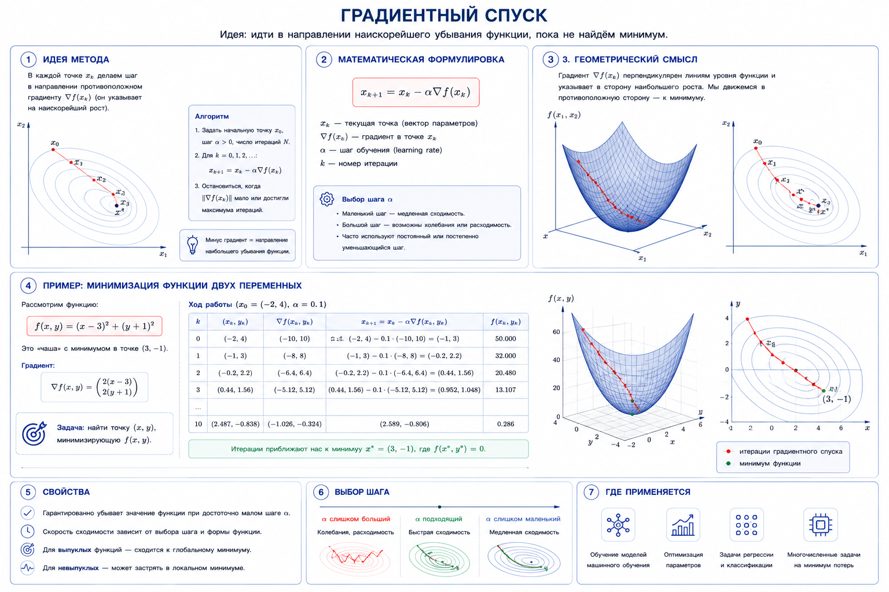

Пошаговый алгоритм:

1. Инициализация. Задаются случайные начальные значения весов ($w^∗$) модели, а также скорость обучения ($α$) — число, определяющее размер шага.
2. Вычисление градиента. Находятся частные производные функции ошибки по каждому параметру ($∇L(w_k)$). Градиент показывает направление самого быстрого роста функции.
3. Определение направления спуска. Берется **антиградиент** (вектор с противоположным знаком), который указывает направление наискорейшего убывания функции ошибки.
4. Обновление весов. Параметры изменяются на величину градиента, умноженную на скорость обучения: $w_{k+1} = w_{k} - α \times ∇L(w_k, X)$.
5. Проверка критерия остановки. Шаги 2–4 повторяются до тех пор, пока на очередной итерации метода градиент не будет около 0.

Сам по себе градиентный спуск — простой метод, но для достижения минимума обычно требуются тысячи или десятки тысяч итераций. на каждом шаге градиентного спуска мы для каждого объекта вычисляем производные по всем весам: другими словами, делаем $N⋅d$ операций. Это очень много — с учётом того, что в современных глубоких нейронных сетях триллионы параметров (весов) и обучаются они на миллионах обучающих объектов. Поэтому существуют модификации классического градиентного спуска, которые без потери точности работают значительно быстрее.

### Стохастический градиентный спуск

Первая модификация называется **стохастическим градиентным спуском** (англ. — Stochastic Gradient Descent, сокращённо SGD). Суть метода в следующем: давайте на каждой итерации градиентного спуска вычислять градиент по одному случайно взятому объекту выборки.
$$∇L(w,X)≈∇L(w,x_i)$$

Благодаря такому подходу на каждой итерации метода мы делаем всего $d$ вычислений, что сильно ускоряет процесс. Однако поскольку на каждой итерации мы выбираем лишь один объект, метод становится шумным, и для сходимости требуется больше итераций.

Лучшим решением будет найти золотую середину между классическим градиентным спуском, где мы считаем градиенты по всей выборке (батч-подход), и стохастическим градиентным спуском — этот вариант реализации метода называется **мини-батч-градиентный спуск** (сокращённо — mini-batch GD).

В этом методе мы фиксируем размер группы объектов (это и есть мини-батч), а затем на каждой итерации вычисляем по ней градиент.
$$∇L(w)≈ \frac{1}{B} \sum_{x_b∈B}∇L(w,x _b)$$

Здесь $x_b∈B$ — сумма по объектам из батча $B$.

Такой подход даёт нам $N⋅B$ вычислений на каждой итерации метода, где $B$ — небольшая константа. Поэтому по сложности он сопоставим со стохастическим градиентным спуском, а по точности гораздо более устойчив и сходится быстрее.

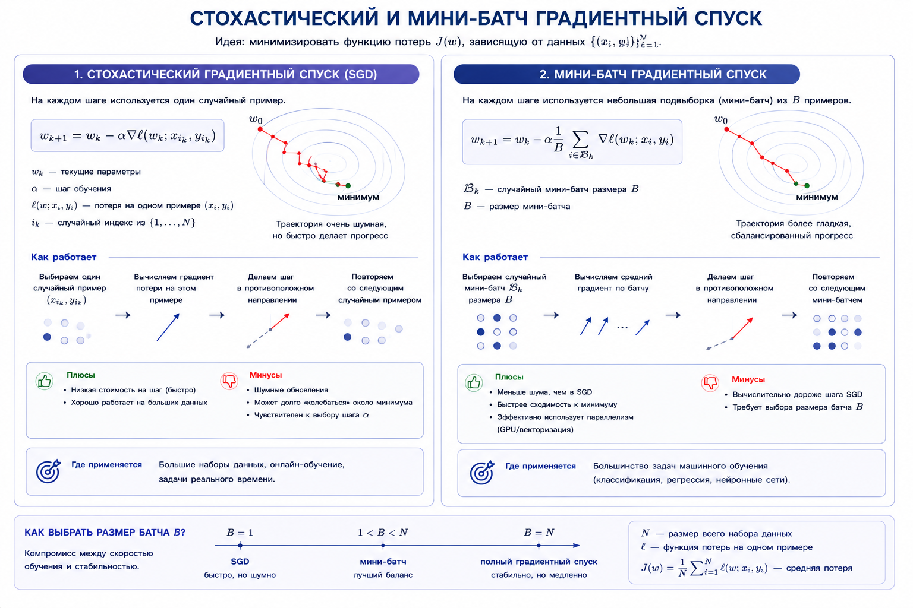

Применение SGD не гарантирует нам попадания в минимум функции потерь. Что может произойти в плохом сценарии:

- Мы можем попасть в локальный (но не глобальный) минимум функции потерь — там градиент также равен нулю, и метод остановится.
- Мы можем вообще не дойти до минимума из-за сложности и разнородности ландшафта функции потерь.

### Критические точки

Производные дают точный инструмент для решения этих задач, так как они 
описывают скорость изменения функции и позволяют выявить её 
**критические точки** — места, где функция перестаёт возрастать или убывать. 
В критических точках первая производная функции равна нулю или не существует. 
То есть такие точки — потенциальные кандидаты на искомые экстремумы.

Функция $f(x)$ имеет **экстремум** в точке $x_0$, если в этой точке она 
достигает локального минимума или максимума:

- Локальный минимум — значение функции меньше всех остальных значений в небольшой окрестности точки.
- Локальный максимум — значение функции больше всех остальных значений в небольшой окрестности точки.

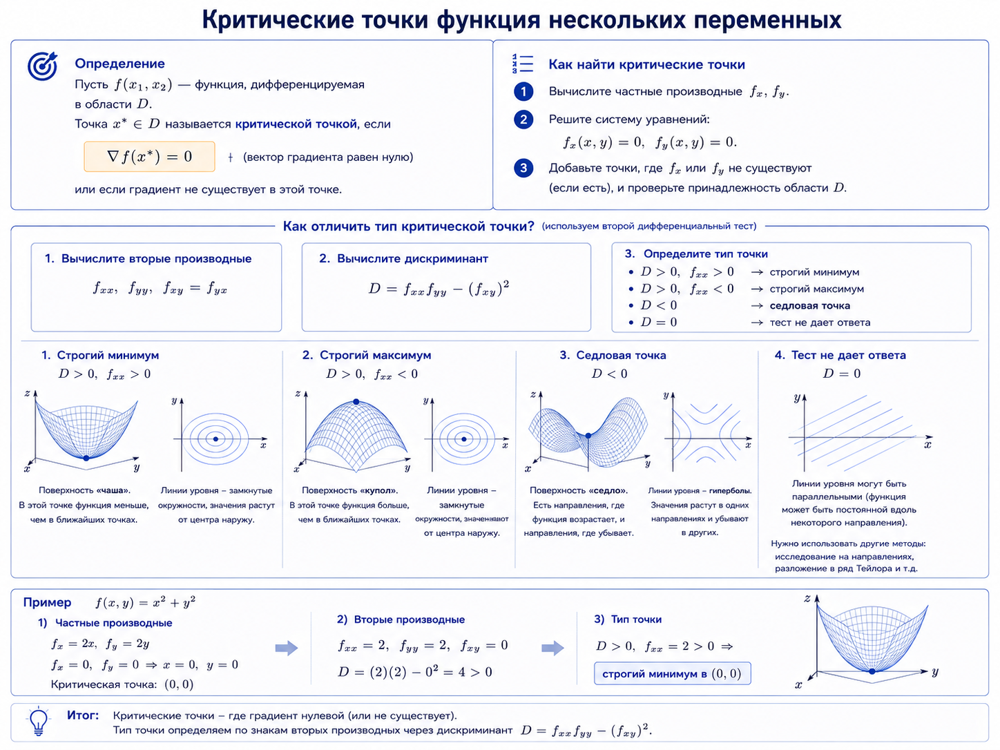

Для анализа характера этих точек (локальный минимум, максимум или перегиб) используется:

1. **Первая** производная — для нахождения критических точек.
2. **Вторая** производная — для определения выпуклости функции в этих точках.

**Выпуклость** функции — это свойство, описывающее, как функция изменяется 
на заданном интервале. Функция называется выпуклой вниз (или просто выпуклой), 
если её график «лежит ниже» любой прямой, соединяющей две произвольные точки 
на графике. Аналогично функция выпукла вверх (или вогнута), если её график 
«лежит выше» такой прямой.

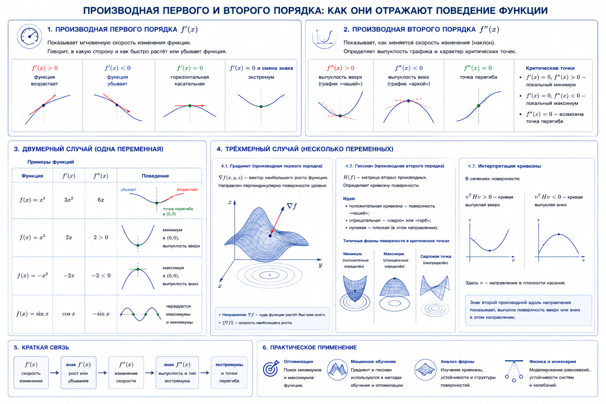

Для функции нескольких переменных $f(w)$ точки, в которых градиент 
обращается в ноль, называются критическими или стационарными
$$∇f(w)=0,$$

В этих точках может находиться локальный минимум или максимум функции — 
или же там может быть точка перегиба.

### Матрица Якоби

Предположим, у вас есть функция, получающая несколько значений и выдающая несколько значений: $v,w =f(x,y,z)$.

Можно вычислить градиент этой функции для $v$, а также для $w$. Если совместить эти два вектора градиентов для создания матрицы, то у нас получится **матрица Якоби**. Вектор градиента также можно рассматривать как матрицу Якоби для функции, выводящей одно скалярное значение, а не вектор.

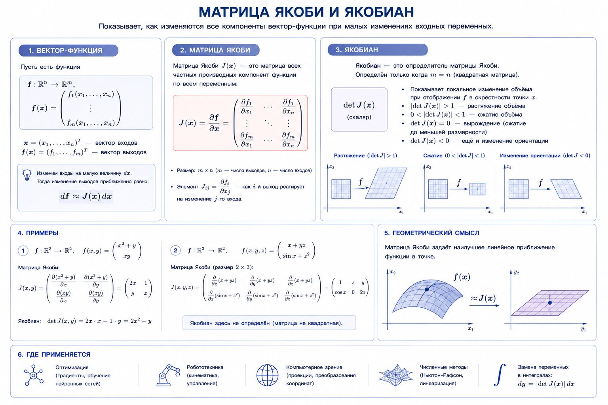

Когда вы вычисляете матрицу Якоби в конкретной точке пространства (в каком бы пространстве ни находились вводные параметры), она показывает, как это пространство **искривлено** в данной области — то есть, насколько развёрнуто и сжато. Вы также можете получить определитель матрицы, чтобы понять, происходит ли в этой области увеличение (то есть определитель больше 1), уменьшение (определитель меньше 1, но больше 0) или же развёртывание в обратную сторону (определитель меньше 0). Если определитель равен 0, значит, всё сжимается в одну точку (линию или некую другую размерность, поскольку как минимум одно измерение масштабируется до 0), и такую операцию отменить нельзя (то есть матрица не инвертируется).

### Матрица Гессе

**Матрица Гессе** - квадратная матрица $H$, в которую входят все возможные вторые частные производные функции.

Пусть функция $f$ задана на векторе $w=(w_1, w_2,…, w_n)$. Тогда элемент матрицы Гессе на пересечении $i$-й строки и $j$-го столбца вычисляется по формуле: $$H_{ij} = \frac{∂^2f}{∂w_i∂w_j}$$

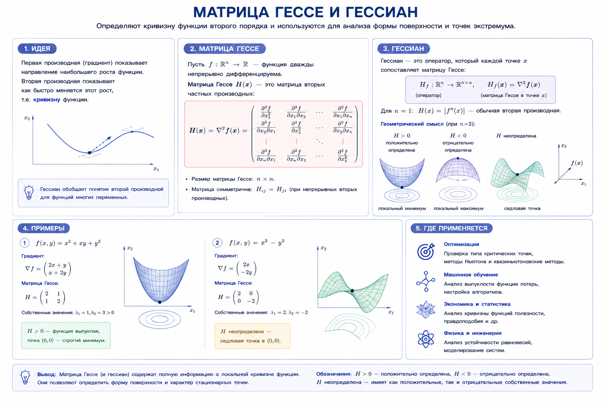

Матрица Гессе описывает **локальную кривизну** функции. Гессиан позволяет заглянуть вглубь поверхности функции и оценить её форму в окрестности критической точки, используя информацию не только о наклоне, но и о его изменении.

- Если матрица $H(w_0)$ положительно определена (все собственные значения строго положительные), то $w_0$ — это локальный минимум. Геометрически это означает, что поверхность функции в этой точке изогнута вверх во всех направлениях, как дно чаши.
- Если матрица $H(w_0)$ отрицательно определена (все собственные значения строго отрицательные), то точка $w_0$ является локальным максимумом. Поверхность при этом изогнута вниз, как купол.
- Если матрица $H(w_0)$ неопределённая (имеются как положительные, так и отрицательные собственные значения), то точка $w_0$ — это седловая точка. Вдоль одних направлений функция возрастает, вдоль других — убывает. Форма поверхности напоминает седло.
- Если матрица $H(w_0)$ вырождена (одно или несколько собственных значений равны нулю), то анализ с помощью второй производной не даёт однозначного ответа. В таком случае необходимо прибегнуть к дополнительным методам исследования.

Градиент указывает на самое крутое направление, но гессиан описывает саму **форму** долины или холма, на котором мы находимся. Его собственные векторы указывают на главные оси кривизны, а соответствующие им собственные значения количественно определяют, насколько эта кривизна резкая или плавная в этих направлениях.

## Связанная практика

- [0.3-practice-yandex.ipynb](0.3-practice-yandex.ipynb) — практика и задания из статьи Яндекс Образования
- [0.0-math-problem-set.ipynb (Часть 3)](../0.0-math-problem-set.ipynb) - задачник по Этапу 0
