# Тема: Теория вероятности

**Источники:**

- [Основы теории вероятностей для будущих программистов и дата-аналитиков | Skillfactory](https://habr.com/ru/companies/skillfactory/articles/825474/)
- [Вероятностное пространство | Яндекс Образование](https://education.yandex.ru/handbook/math/article/veroiatnostnoe-prostranstvo)
- [Условная вероятность и независимость событий | Яндекс Образование](https://education.yandex.ru/handbook/math/article/uslovnaia-veroiatnost-i-nezavisimost-sobitii)
- [Дискретные случайные величины | Яндекс Образование](https://education.yandex.ru/handbook/math/article/diskretnie-sluchainie-velichini)
- [Непрерывные случайные величины | Яндекс Образование](https://education.yandex.ru/handbook/math/article/neprerivnie-sluchainie-velichini)
- [Совместное распределение. Ковариация и коэффициент корреляции | Яндекс Образование](https://education.yandex.ru/handbook/math/article/sovmestnoe-raspredelenie-kovariatsiia-i-koeffitsient-korreliatsii)
- [Энтропия. Перплексия. KL-дивергенция | Яндекс Образование](https://education.yandex.ru/handbook/math/article/entropiia-perpleksiia-kl-divergentsiia)
- [Про вероятности | Хабр](https://habr.com/ru/articles/351400/)

## Зачем это нужно

Почти любая задача в анализе данных и машинном обучении - это работа со случайностью: данные зашумлены, разметка неидеальна, а модели выдают не точный ответ, а распределение вероятностей по вариантам. Теория вероятности даёт язык, на котором эту неопределённость можно строго описывать и считать: от простого «какова вероятность события» до того, как измерить расхождение между предсказанием модели и реальностью.

## Теория

### Вероятностное пространство

**Вероятностное пространство** - это тройка $(\Omega, \mathcal{F}, P)$, которая задаёт всё, что нужно для строгого описания случайного эксперимента:

- $\Omega$ - **пространство элементарных исходов**: множество всех возможных результатов одного эксперимента (например, для броска кубика - числа от 1 до 6);
- $\mathcal{F}$ - множество **случайных событий**, то есть подмножеств $\Omega$, для которых мы умеем считать вероятность;
- $P$ - функция, которая каждому событию ставит в соответствие число от 0 до 1, причём $P(\Omega) = 1$, а вероятность объединения непересекающихся событий равна сумме их вероятностей.

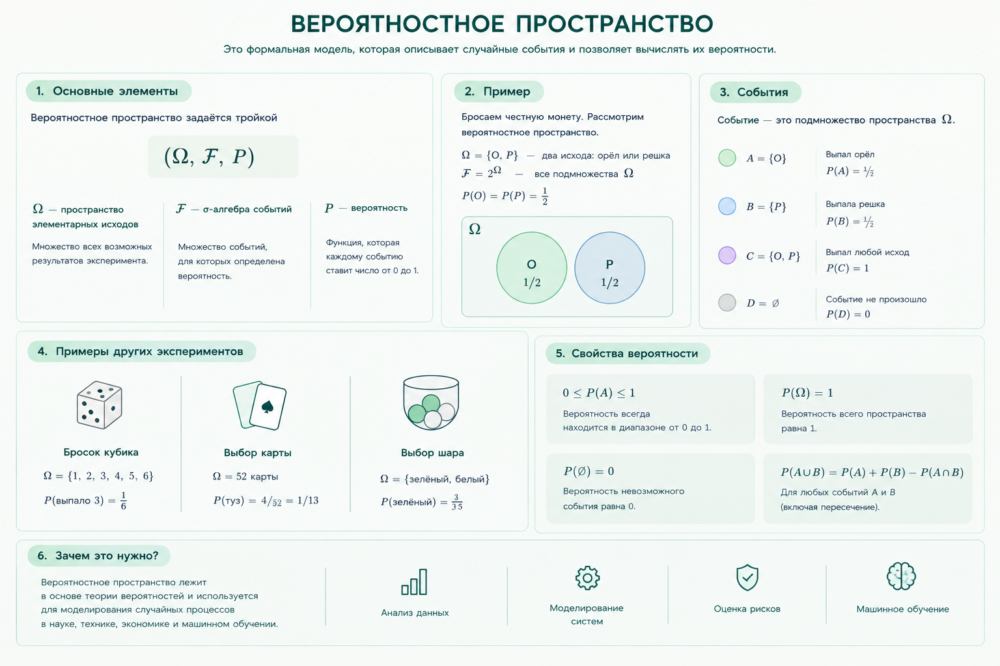

Если элементарных исходов конечное число и все они равновероятны (например, честный кубик), получается **модель классической вероятности**: вероятность события равна доле *благоприятных* исходов среди всех:

$$
P(A) = \frac{|A|}{|\Omega|}
$$

Если же $\Omega$ - не конечное множество, а геометрическая область (отрезок, квадрат), используется **модель геометрической вероятности**: вероятность попадания в подобласть пропорциональна её «размеру» (длине, площади) относительно размера всей области.

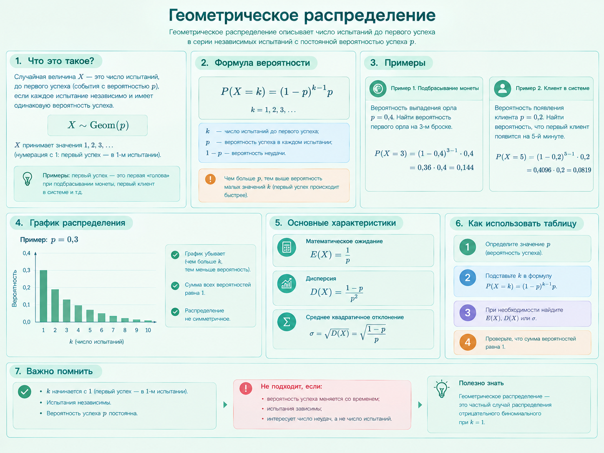

На практике вероятностное пространство редко задают вручную - чаще его строят **частотным подходом**: проводят эксперимент много раз и берут долю каждого исхода в качестве его вероятности (это прямое следствие закона больших чисел).

### Условная вероятность

**Условная вероятность** события $B$ при условии, что произошло событие $A$ (с $P(A) > 0$):

$$
P(B \mid A) = \frac{P(A \cap B)}{P(A)}
$$

Это понятие лежит в основе метрик классификации **precision** и **recall**: обе по сути являются условными вероятностями - например, $\text{recall} = P(\text{модель сказала «болен»} \mid \text{человек действительно болен})$.

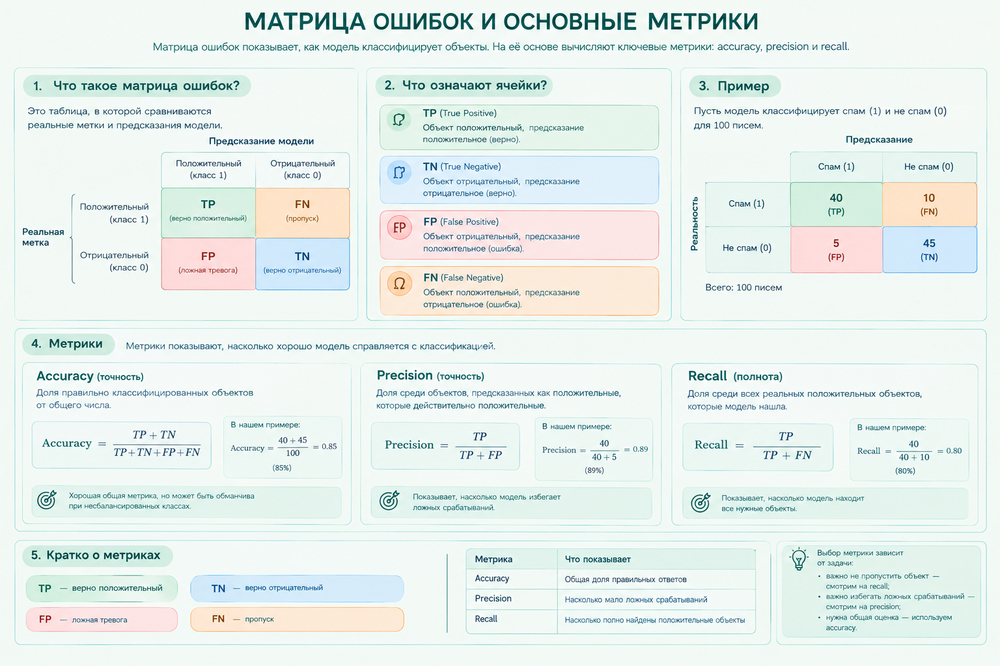

### Формула Байеса и формула полной вероятности

Переписав формулу условной вероятности относительно $P(A \cap B)$ двумя способами, получаем **формулу Байеса**:

$$
P(A \mid B) = \frac{P(B \mid A) \, P(A)}{P(B)}
$$

В терминологии, принятой в ML, компоненты формулы называют так: $P(A)$ - **prior** (априорная вероятность), $P(B \mid A)$ - **likelihood** (правдоподобие), $P(A \mid B)$ - **posterior** (апостериорная вероятность), $P(B)$ - **evidence** (свидетельство, нормировочная константа).

Если событие $B$ нужно раскрыть через несколько непересекающихся гипотез $H_1, \dots, H_n$ (с $\sum P(H_i) = 1$), используется **формула полной вероятности**:

$$
P(B) = \sum_{i=1}^{n} P(B \mid H_i) \, P(H_i)
$$

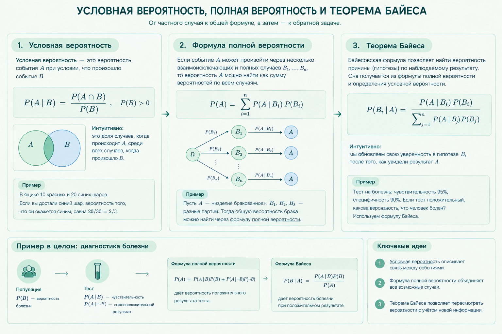

### Независимость событий

События $A$ и $B$ **независимы**, если знание об одном не меняет вероятность другого:

$$
P(A \cap B) = P(A) \cdot P(B)
$$

Из **попарной независимости** набора событий не следует их **независимость в совокупности** - нужно проверять строго математически, а не полагаться на интуицию.

Отдельно вводится **условная независимость**: события $A$ и $B$ независимы при условии $C$, если $P(A \cap B \mid C) = P(A \mid C)P(B \mid C)$ - это не то же самое, что обычная независимость $A$ и $B$.

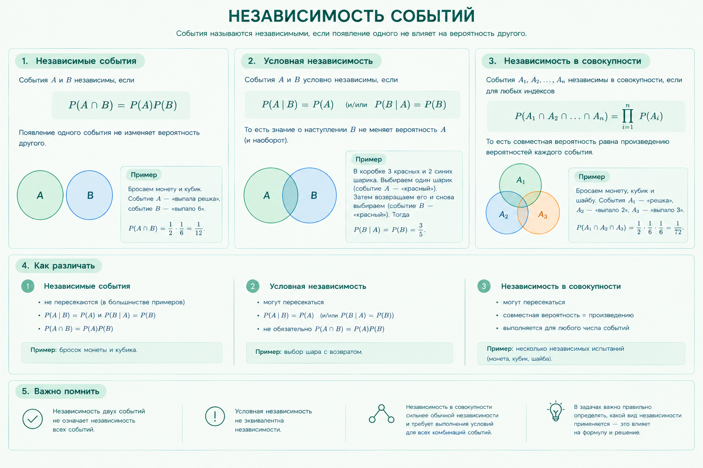

### Наивный байесовский классификатор

Если нужно классифицировать объект (например, письмо - спам/не спам) по набору признаков $x = (x_1, \dots, x_n)$ (например, наличие ключевых слов), по формуле Байеса:

$$
P(\text{класс} \mid x_1, \dots, x_n) \propto P(x_1, \dots, x_n \mid \text{класс}) \cdot P(\text{класс})
$$

Проблема в том, что оценить совместную вероятность $P(x_1, \dots, x_n \mid \text{класс})$ по выборке разумного размера почти невозможно при большом числе признаков. **Наивное предположение** - считать, что признаки условно независимы при фиксированном классе:

$$
P(x_1, \dots, x_n \mid \text{класс}) \approx \prod_{i=1}^{n} P(x_i \mid \text{класс})
$$

Это предположение почти никогда не выполняется в реальности буквально, но на практике даёт работающий и очень быстрый классификатор - отсюда и название «наивный».

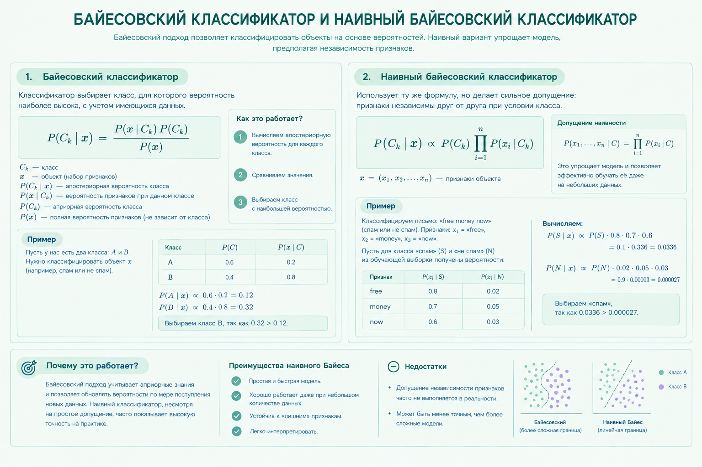

### Случайные величины: дискретные

**Случайная величина** $X$ - это функция, которая каждому элементарному исходу ставит в соответствие число. Для анализа обычно важно не само вероятностное пространство, а **распределение** величины - таблица или формула, описывающая, с какими вероятностями она принимает разные значения.

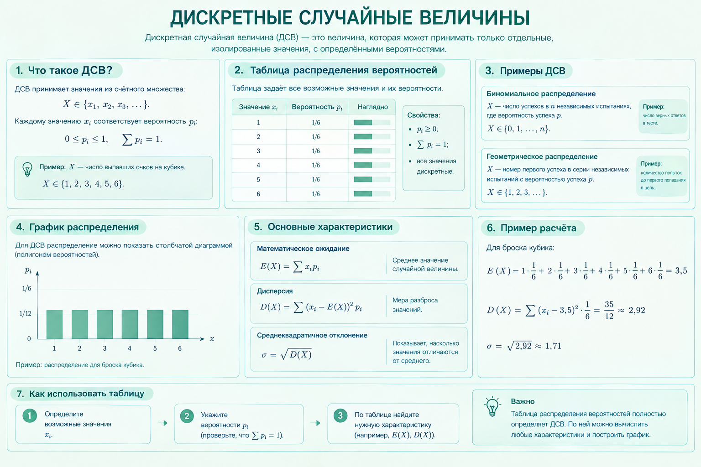

**Дискретная случайная величина** принимает конечное или счётное число значений. Основные типовые распределения:

- **Распределение Бернулли** $\text{Bern}(p)$ - один опыт с вероятностью успеха $p$ (значения 0/1).

- **Биномиальное распределение** $\text{Bin}(n, p)$ - число успехов в серии из $n$ независимых испытаний Бернулли:

    $$
    P(X=k) = C_n^k \, p^k (1-p)^{n-k}
    $$
    
    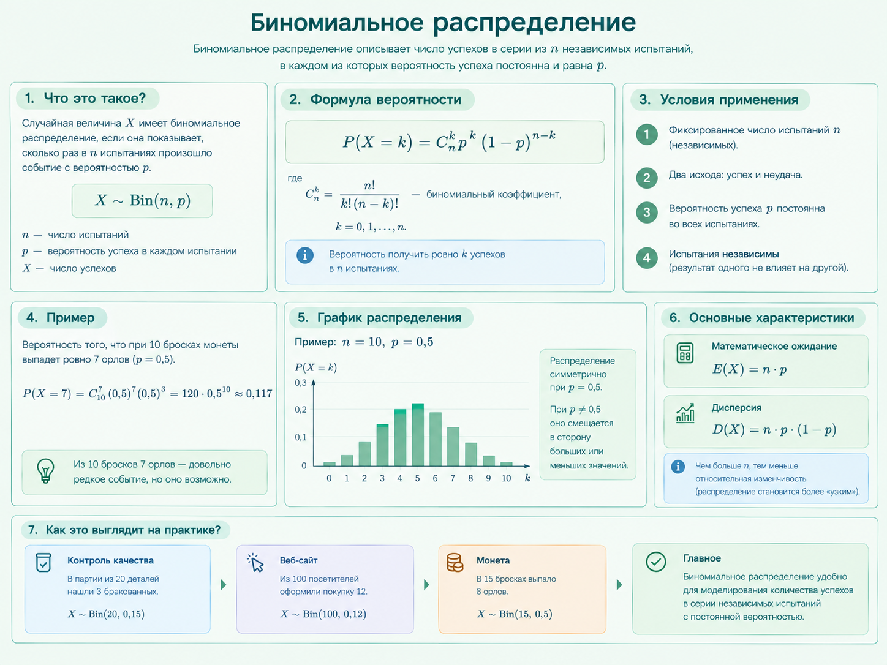

- **Распределение Пуассона** $\text{Pois}(\lambda)$ - число событий простейшего потока (покупатели в магазине, запросы к серверу в секунду) за фиксированный промежуток:

    $$
    P(X=k) = \frac{\lambda^k e^{-\lambda}}{k!}
    $$

    Возникает как предельный случай биномиального распределения при большом $n$ и малом $p$, когда $np \to \lambda$ - это и объясняет, почему редкие по отдельности, но массовые по числу испытаний события (клик по баннеру, сбой сервера) хорошо описываются именно Пуассоном.

    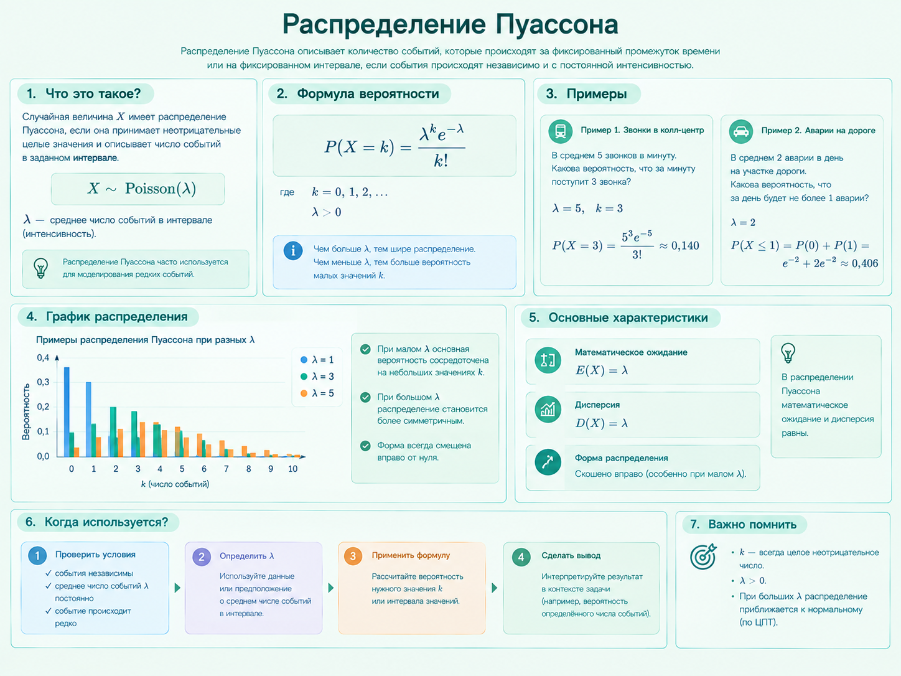

- **Геометрическое распределение** $\text{Geom}(p)$ - число неудач до первого успеха в серии испытаний Бернулли: $P(X=k) = (1-p)^k p$.

    

### Непрерывные случайные величины, плотность вероятности

**Непрерывная случайная величина** принимает бесконечно много значений из интервала, и вероятность любого *конкретного* значения равна нулю. Вместо таблицы вероятностей используется **плотность вероятности** $p(x)$:

$$
P(X \in [a,b]) = \int_a^b p(x)\,dx, \qquad \int_{-\infty}^{\infty} p(x)\,dx = 1
$$

- **Равномерное распределение** $U[a,b]$ - постоянная плотность $p(x) = \frac{1}{b-a}$ на отрезке.
- **Экспоненциальное распределение** $\text{Exp}(\lambda)$ - время между последовательными событиями простейшего потока (тот же $\lambda$, что и в распределении Пуассона): $p(x) = \lambda e^{-\lambda x}$ для $x \geq 0$.

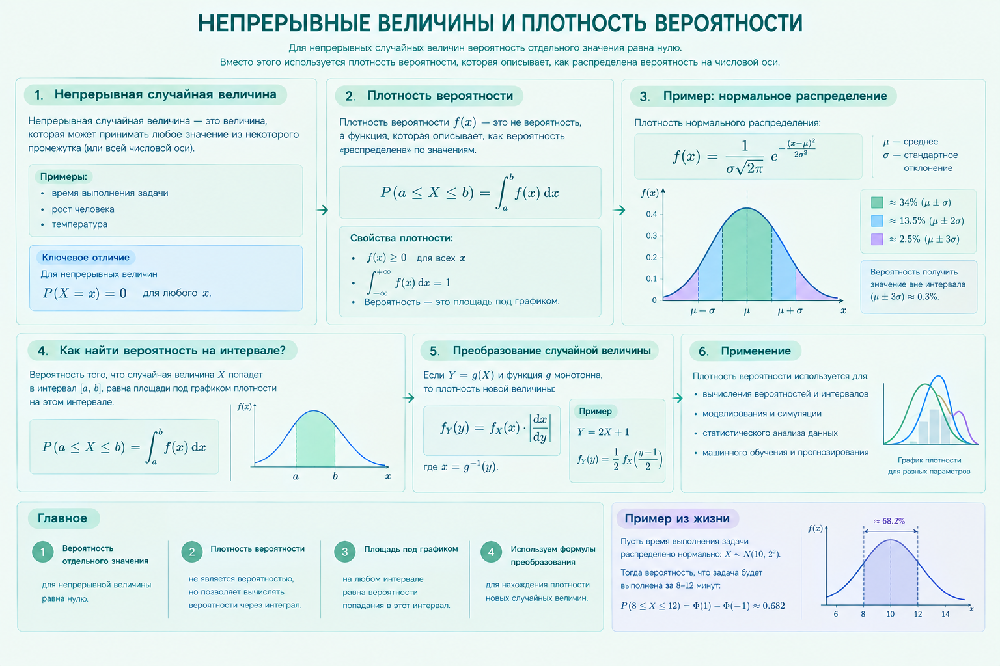

### Математическое ожидание

**Математическое ожидание** - среднее значение случайной величины, взвешенное по вероятностям:

$$
E[X] = \sum_i x_i P(X=x_i) \quad \text{(дискретный случай)}, \qquad E[X] = \int_{-\infty}^{\infty} x\,p(x)\,dx \quad \text{(непрерывный)}
$$

Ключевое свойство - **линейность**, которая выполняется *всегда*, даже если величины зависимы:

$$
E[aX + bY] = aE[X] + bE[Y]
$$

Для функции от случайной величины матожидание можно найти, не вычисляя распределение самой функции:

$$
E[g(X)] = \sum_i g(x_i) P(X=x_i) \quad \text{или} \quad E[g(X)] = \int g(x)\,p(x)\,dx
$$

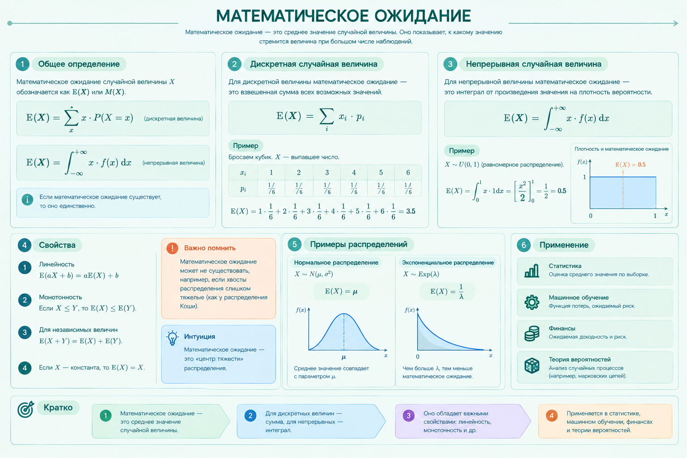

### Дисперсия и среднеквадратичное отклонение

**Дисперсия** измеряет, насколько сильно величина отклоняется от своего среднего:

$$
D[X] = E\big[(X - E[X])^2\big] = E[X^2] - (E[X])^2
$$

Так как дисперсия измеряется в квадрате единиц $X$, для интерпретации удобнее **среднеквадратичное отклонение** $\sigma = \sqrt{D[X]}$ - оно уже в тех же единицах, что и сама величина.

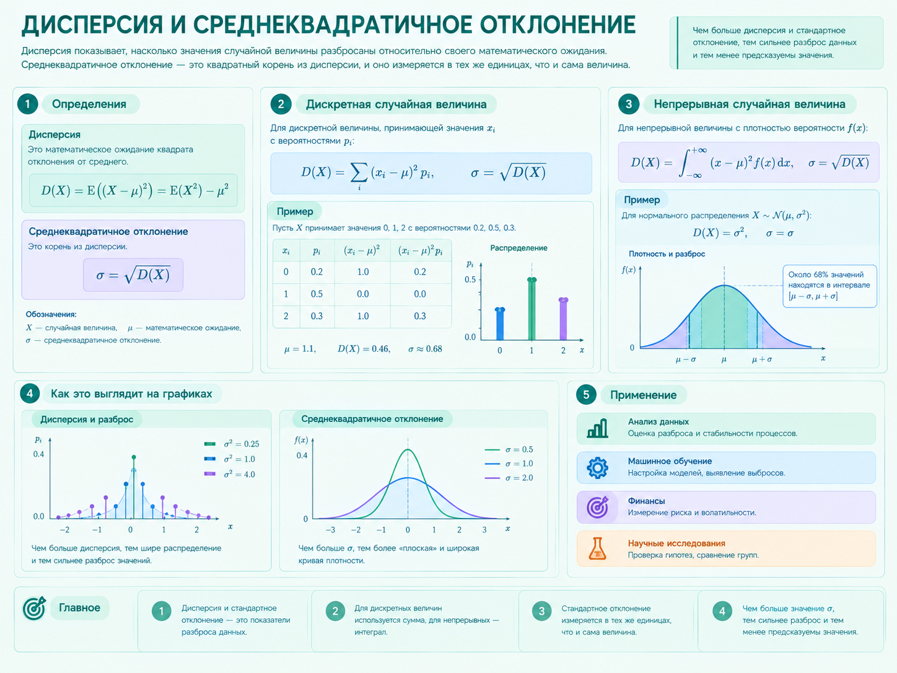

### Нормальное распределение

**Нормальное распределение** $\mathcal{N}(\mu, \sigma^2)$ - самое частое распределение на практике, потому что сумма большого числа независимых случайных величин стремится к нормальному (центральная предельная теорема):

$$
p(x) = \frac{1}{\sigma\sqrt{2\pi}} \exp\left(-\frac{(x-\mu)^2}{2\sigma^2}\right)
$$

**Правило трёх сигм**: примерно 68% значений лежат в пределах $\mu \pm \sigma$, 95% - в пределах $\mu \pm 2\sigma$, 99.7% - в пределах $\mu \pm 3\sigma$. Нормальное распределение встречается не только в данных (рост людей, ошибки измерений), но и в самих моделях - например, веса нейросетей инициализируют из нормального распределения, а скрытое пространство вариационного автоэнкодера (VAE) специально обучают быть нормально распределённым.

### Совместное распределение и независимость случайных величин

Когда нужно анализировать две величины одновременно (например, время на сайте и сумма покупки), используется **совместное распределение** - таблица $P(X=x_i, Y=y_j)$ для дискретного случая или совместная плотность $p(x,y)$ для непрерывного. Из совместного распределения суммированием (или интегрированием) по одной из переменных получают **маргинальное распределение** каждой величины по отдельности.

$X$ и $Y$ **независимы**, если $P(X=x, Y=y) = P(X=x)\,P(Y=y)$ для любых $x, y$ (аналогично через плотности для непрерывного случая). Для независимых величин $E[XY] = E[X]\,E[Y]$ - это сильно упрощает вычисления.

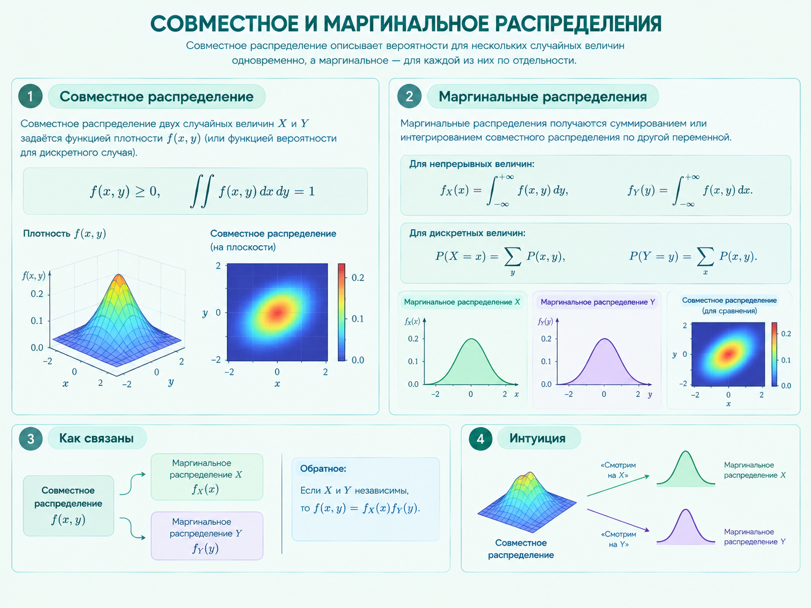

### Ковариация

**Ковариация** измеряет, насколько две величины меняются согласованно:

$$
\text{Cov}(X,Y) = E\big[(X-E[X])(Y-E[Y])\big] = E[XY] - E[X]E[Y]
$$

Её можно рассматривать как обобщение скалярного произведения векторов на случайные величины (а дисперсию - как аналог квадрата длины вектора). Если величины независимы, ковариация равна нулю - но **обратное неверно**: нулевая ковариация означает лишь отсутствие *линейной* связи, нелинейная зависимость при этом может быть сколь угодно сильной (классический пример - параболическая зависимость, симметричная относительно среднего).

Ковариация также входит в формулу дисперсии суммы:

$$
D[X+Y] = D[X] + D[Y] + 2\,\text{Cov}(X,Y)
$$

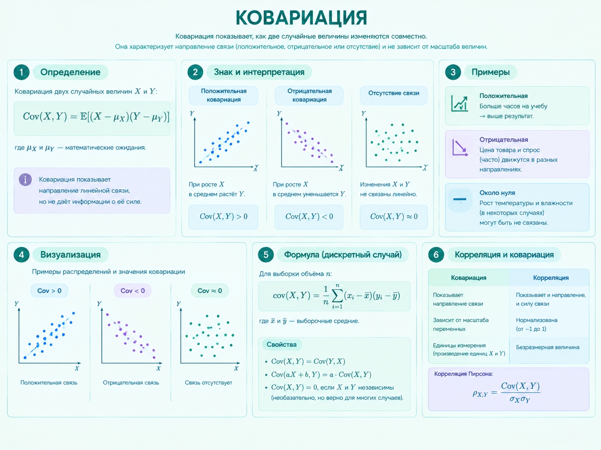

### Коэффициент корреляции

Поскольку у ковариации нет фиксированного масштаба (зависит от единиц измерения), для измерения силы *линейной* связи используется нормированный **коэффициент корреляции**, всегда лежащий в $[-1, 1]$:

$$
\rho(X,Y) = \frac{\text{Cov}(X,Y)}{\sigma_X \sigma_Y}
$$

Для удобства восприятия коэффициенты корреляции всех признаков собирают в так называемую **корреляционную матрицу**. Её удобно вывести в виде тепловой карты, на которой красным отмечены значения, близкие к 1, и синим отмечены значения, близкие к -1.

На практике по выборке вычисляют **выборочный коэффициент корреляции Пирсона** - именно его возвращает `np.corrcoef` и `pandas.DataFrame.corr()`. Он чувствителен только к *линейным* связям и к выбросам. Альтернатива - **коэффициент корреляции Спирмена**, вычисляемый по рангам значений, а не по самим значениям: он улавливает любую *монотонную* связь (не обязательно линейную) и устойчивее к выбросам.

### Энтропия Шеннона

**Энтропия** измеряет неопределённость случайной величины - насколько непредсказуем её исход:

$$
H(X) = -\sum_i P(x_i) \log P(x_i) = -E[\log P(X)]
$$

Чем равномернее распределены вероятности, тем выше энтропия (максимум - при равномерном распределении); если исход детерминирован, энтропия равна нулю. В машинном обучении энтропия - стандартный критерий при построении решающих деревьев: выбирается вопрос (разбиение), который даёт наибольший **информационный выигрыш** (information gain) - то есть сильнее всего снижает энтропию (неопределённость) в дочерних узлах.

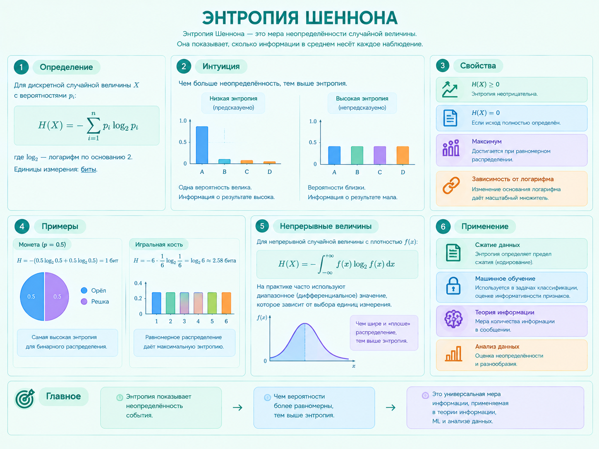

### Перплексия

**Перплексия** - более интуитивная шкала для той же неопределённости, своего рода «эффективное число вариантов»:

$$
\text{Perplexity}(X) = 2^{H(X)}
$$

Если распределение модели сосредоточено на нескольких вариантах - перплексия мала (модель «уверена»); если размазано почти равномерно по многим вариантам - перплексия велика (модель «теряется»). Именно перплексия - стандартная метрика качества языковых моделей: низкая перплексия на тестовом тексте значит, что модель хорошо предсказывает следующий токен.

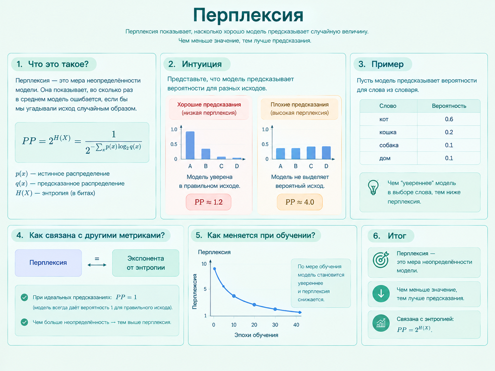

### KL-дивергенция

**Дивергенция Кульбака - Лейблера** измеряет, насколько одно распределение $Q$ отличается от другого $P$:

$$
D_{KL}(P \,\|\, Q) = \sum_i P(x_i) \log \frac{P(x_i)}{Q(x_i)}
$$

Важное свойство - **асимметричность**: $D_{KL}(P\|Q) \neq D_{KL}(Q\|P)$ в общем случае. KL-дивергенция всегда $\geq 0$, причём равна нулю только когда распределения полностью совпадают. В машинном обучении она встречается постоянно: в **дистилляции моделей** (компактная модель учится воспроизводить распределение вероятностей «учителя» через минимизацию KL-дивергенции) и в **вариационных автоэнкодерах** (VAE), где KL-дивергенция заставляет распределение скрытых переменных быть похожим на заданное априорное (обычно стандартное нормальное).

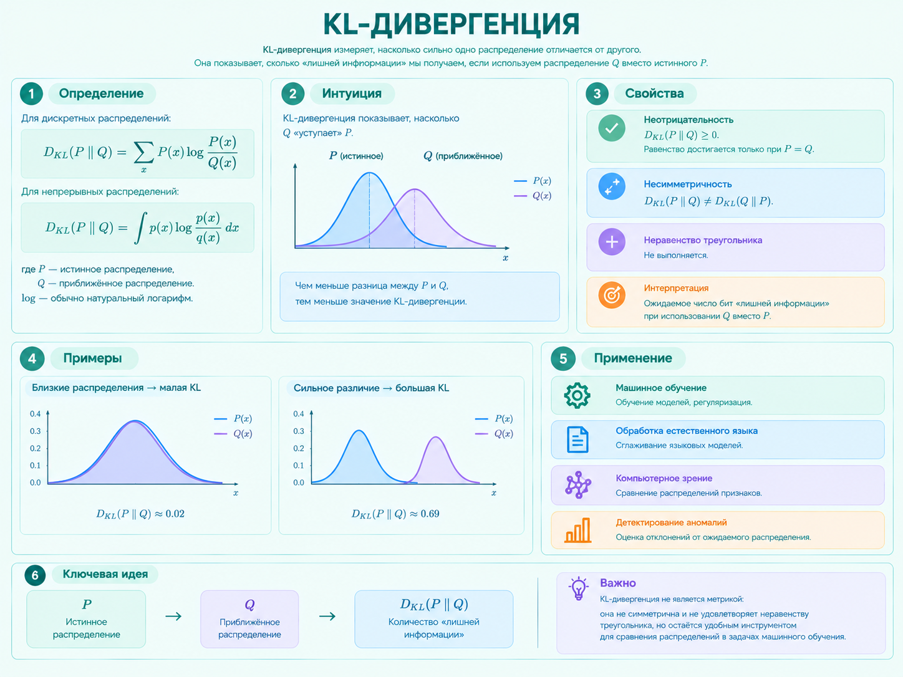

## Связанная практика

- [0.4-practice-yandex.ipynb](0.4-practice-yandex.ipynb) - практика и задания из статей Яндекс Образования
- [0.0-math-problem-set.ipynb (Часть 4)](../0.0-math-problem-set.ipynb) - задачник по Этапу 0
