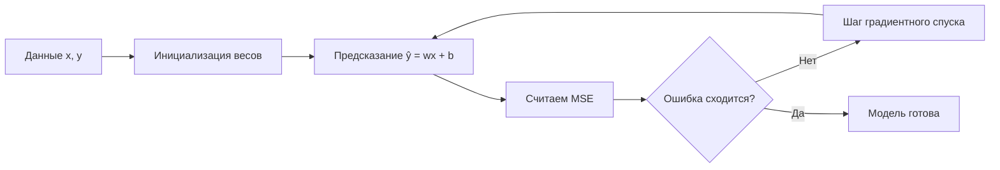
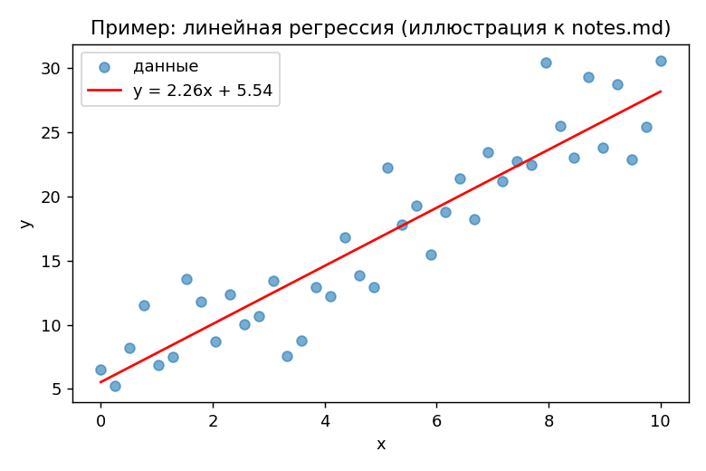

# Тема: Линейная регрессия

**Источники:** HSE ml-course-hse — лекция "Линейная регрессия"; mlcourse.ai — тема 4
**Дата:** 2026-07-21
**Статус:** ✅ (пример заполненного конспекта — для демонстрации формата, замените на свой)

## Зачем это нужно

Линейная регрессия — самая простая модель, которая уже показывает всю механику обучения: есть параметры, есть функция ошибки, есть процедура их сближения. Всё остальное в ML — усложнение этой же схемы.

## Теория

Модель предсказывает целевую переменную как взвешенную сумму признаков:

$$
\hat{y} = w^T x + b
$$

Качество подбора весов измеряется функцией потерь (MSE):

$$
L(w, b) = \frac{1}{n}\sum_{i=1}^{n} (y_i - \hat{y}_i)^2
$$

Аналитическое решение (нормальное уравнение) существует, но плохо масштабируется на больших признаковых пространствах — отсюда переход к градиентному спуску:

$$
w := w - \eta \frac{\partial L}{\partial w}
$$

Регуляризация (Ridge/Lasso) добавляет штраф за величину весов, чтобы бороться с переобучением:

$$
L_{ridge}(w) = L(w) + \lambda \|w\|_2^2
$$

## Схема / интуиция

## График / визуализация

*Пример сгенерирован в practice-hse.ipynb — синтетические данные с шумом и подобранная прямая.*

## Частые ошибки / на чём споткнулся

- Путал регуляризацию Ridge (L2) и Lasso (L1) — Lasso зануляет часть весов (отбор признаков), Ridge — только уменьшает, но не зануляет.
- Забывал масштабировать признаки перед регуляризацией — без этого штраф несправедливо сильнее давит на признаки с большим разбросом значений.

## Связанная практика

- `practice-hse.ipynb` — домашка HSE: вывод нормального уравнения руками + реализация градиентного спуска на NumPy без sklearn
- `practice-mlcourse.ipynb` — задание mlcourse.ai: линейная регрессия на реальном датасете (недвижимость), сравнение с Ridge/Lasso из sklearn

## Что дальше почитать/уточнить

- Cornell CS4780: разбор bias-variance для линейных моделей, если MSE на трейне и тесте сильно расходятся
