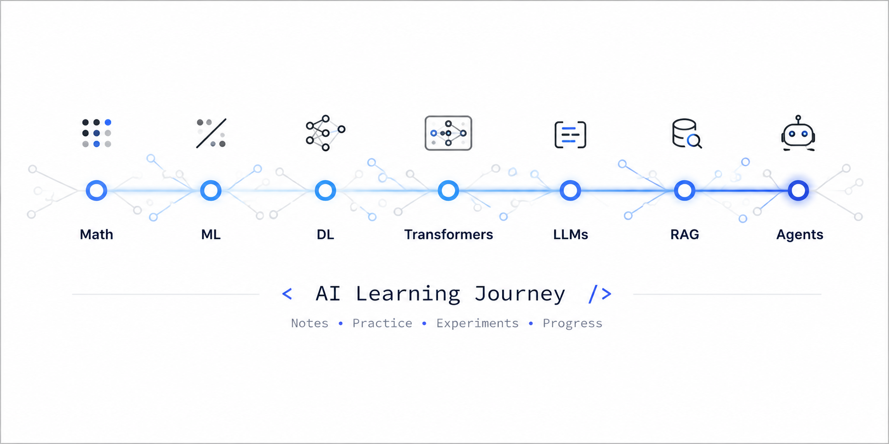

# ML/AI Learning Journal


Личный репозиторий с конспектами, практикой и прогрессом по изучению ML/AI — от классического ML до LLM и агентных систем.

## Как устроен репозиторий

```
ml-learning-journal/
├── 00-prerequisites/      ← математика/Python-база (для повторения/закрепления основ)
├── 01-classical-ml/       ← линейные модели, деревья, ансамбли, кластеризация
├── 02-dl-foundations/     ← основы Deep Learning (fast.ai + UvA)
├── 03-nn-from-scratch/    ← нейросети и трансформеры "с нуля" (Karpathy и др.)
├── 04-nlp-llm/            ← NLP, трансформеры, LLM, post-training
├── 05-projects/           ← законченные пет-проекты и Kaggle-соревнования
├── 06-agents/             ← агентные системы, harness, память
└── _templates/            ← шаблоны для нового конспекта/практики/итога
```

Каждая тема внутри этапа — отдельная папка с таким набором файлов:

```
NN-название-темы/
├── notes.md              ← конспект: теория, формулы, схемы
├── practice-<источник>.ipynb   ← практика, привязанная к конкретному заданию
└── assets/               ← картинки, интерактивные HTML-графики к notes.md
```


## Прогресс

Статусы: ⬜ не начато · 🔄 в процессе · ✅ готово

### Этап 0. Предпосылки

| Тема | Статус | Теория | Практика |
|---|---|---|---|
| Линейная алгебра | ✅ | [Конспект](0.0-prerequisites/0.1-linear-algebra/0.1-notes.md) | [0.1-practice-habr-KuzMax13.ipynb](0.0-prerequisites/0.1-linear-algebra/0.1-practice-habr-KuzMax13.ipynb)<br>[0.1-practice-yandex.ipynb](0.0-prerequisites/0.1-linear-algebra/0.1-practice-yandex.ipynb)<br>[0.0-math-problem-set.ipynb (Часть 1)](0.0-prerequisites/0.0-math-problem-set.ipynb)|
| Матрицы | ✅ | [Конспект](0.0-prerequisites/0.2-matrix/0.2-notes.md) | [0.2-practice-mfti.ipynb](0.0-prerequisites/0.2-matrix/0.2-practice-mfti.ipynb)<br>[0.2-practice-yandex.ipynb](0.0-prerequisites/0.2-matrix/0.2-practice-yandex.ipynb)<br>[0.0-math-problem-set.ipynb (Часть 2)](0.0-prerequisites/0.0-math-problem-set.ipynb)|
| Основы мат. анализа | 🔄 | | |
| Теория вероятности | ⬜ | | |

### Этап 1. Классический ML

| Тема | Статус | Теория | Практика |
|---|---|---|---|
| Линейная регрессия, регуляризация | ⬜ | | |
| Метрики качества классификации | ⬜ | | |
| kNN | ⬜ | | |
| Логистическая регрессия, SVM | ⬜ | | |
| Решающие деревья | ⬜ | | |
| Бэггинг, случайный лес, бустинг | ⬜ | | |
| Отбор и построение признаков | ⬜ | | |
| Понижение размерности, PCA | ⬜ | | |
| Кластеризация, k-means | ⬜ | | |

### Этап 2. DL основы

| Тема | Статус | Теория | Практика |
|---|---|---|---|
| PyTorch основы, activation/init/optimization | ⬜ | | |
| Нейросети с нуля (градиентный спуск руками) | ⬜ | | |
| CNN | ⬜ | | |
| NLP-интуиция (без глубокого погружения) | ⬜ | | |
| Табличные данные, random forest, collab filtering | ⬜ | | |

### Этап 3. Нейросети/трансформеры с нуля

| Тема | Статус | Теория | Практика |
|---|---|---|---|
| Как устроены LLM (концептуально) | ⬜ | | |
| micrograd | ⬜ | | |
| makemore | ⬜ | | |
| nanoGPT | ⬜ | | |
| minBPE (токенизация) | ⬜ | | |
| Трансформер на NumPy с нуля | ⬜ | | |

### Этап 4. NLP/LLM

| Тема | Статус | Теория | Практика |
|---|---|---|---|
| HF LLM Course, гл. 1–4 | ⬜ | | |
| HF LLM Course, гл. 5–9 | ⬜ | | |
| smol course / post-training (SFT, DPO) | ⬜ | | |
| RAG-пайплайн (свой проект) | ⬜ | | |

### Этап 5. Проекты/специализация

| Проект | Статус | Дата | Ссылка |
|---|---|---|---|
| | ⬜ | | |

### Этап 6. Агентные системы

| Тема | Статус | Теория | Практика |
|---|---|---|---|
| Building Effective Agents, 12-factor-agents | ⬜ | | |
| HF Context Course | ⬜ | | |
| HF Agents Course | ⬜ | | |
| Свой agent loop + tool calling с нуля | ⬜ | | |
| Память агента (файл/SQLite) | ⬜ | | |

## Итоги по этапам

Заполняются по мере прохождения каждого этапа (см. `_templates/SUMMARY-template.md`):

- [ ] Этап 0 — [SUMMARY.md](00-prerequisites/SUMMARY.md)
- [ ] Этап 1 — [SUMMARY.md](01-classical-ml/SUMMARY.md)
- [ ] Этап 2 — [SUMMARY.md](02-dl-foundations/SUMMARY.md)
- [ ] Этап 3 — [SUMMARY.md](03-nn-from-scratch/SUMMARY.md)
- [ ] Этап 4 — [SUMMARY.md](04-nlp-llm/SUMMARY.md)
- [ ] Этап 6 — [SUMMARY.md](06-agents/SUMMARY.md)
