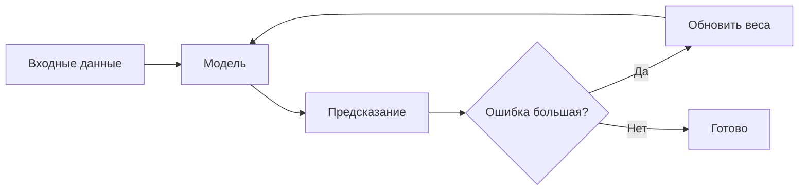

# Тема: <название>

**Источники:** <HSE лекция N / mlcourse.ai тема N / ...>
**Дата:** <YYYY-MM-DD>
**Статус:** 🔄

## Зачем это нужно (в двух предложениях)

<Проверка на понимание: если не можете объяснить просто — не до конца разобрались>

## Теория

<Основные идеи своими словами, не пересказ источника>

Пример формулы (рендерится на GitHub из коробки):

$$
\hat{y} = w^T x + b
$$

Функция потерь:

$$
L(w) = \frac{1}{n}\sum_{i=1}^{n} (y_i - \hat{y}_i)^2
$$

## Схема / интуиция

Пример Mermaid-диаграммы (тоже рендерится нативно на GitHub, без плагинов):



## График / визуализация

Статичный график — сохраните PNG из ноутбука в папку `assets/` рядом и вставьте:

```markdown

```

Если график интерактивный (Plotly/Bokeh) — экспортируйте как самодостаточный `.html` в `assets/` и сошлитесь:

```markdown
[Открыть интерактивный график](assets/имя-файла.html)
```

## Частые ошибки / на чём споткнулся

<Личные заметки — то, что реально мешало понять, а не общие слова>

## Связанная практика

- `practice-<источник>.ipynb` — <что именно там сделано>

## Что дальше почитать/уточнить

<опционально>
